# Manual do Sistema — FiscoAtlas

> **Versão:** 1.3 (reabertura formal, guarda de ano fechado e dados estruturais)  
> **Data:** 12/09/2026  
> **Sistema:** FiscoAtlas — Imposto sobre Investimentos no Exterior (EUA)  
> **Base legal:** Lei nº 14.754/2023, IN RFB 2.180/2024, Lei nº 15.270/2025

---

## Sumário

1. [Visão Geral](#1-visão-geral)
2. [Entenda a Regra — Como o Imposto Funciona](#2-entenda-a-regra--como-o-imposto-funciona)
3. [Requisitos e Instalação](#3-requisitos-e-instalação)
4. [Primeiro Acesso — Configuração de Segurança](#4-primeiro-acesso--configuração-de-segurança)
5. [Tela de Bloqueio e Desbloqueio](#5-tela-de-bloqueio-e-desbloqueio)
6. [Dashboard — Lista de Eventos](#6-dashboard--lista-de-eventos)
7. [Perfil do Contribuinte](#7-perfil-do-contribuinte)
8. [Contas (Caixas)](#8-contas-caixas)
9. [Cadastro de Ativos](#9-cadastro-de-ativos)
10. [Lançamento de Eventos Financeiros](#10-lançamento-de-eventos-financeiros)
11. [Posições](#11-posições)
12. [Caixa](#12-caixa)
13. [Posição de Abertura](#13-posição-de-abertura)
14. [Apuração Anual](#14-apuração-anual)
15. [Relatório DIRPF](#15-relatório-dirpf)
16. [PTAX de Fechamento](#16-ptax-de-fechamento)
17. [Segurança](#17-segurança)
18. [Documentos](#18-documentos)
19. [Fluxo Completo — Passo a Passo](#19-fluxo-completo--passo-a-passo)
20. [Regras de Negócio](#20-regras-de-negócio)
21. [Ciclo de Vida Multi-Anos e Backup](#21-ciclo-de-vida-multi-anos-e-backup)
22. [Troubleshooting — Se Algo Der Errado](#22-troubleshooting--se-algo-der-errado)
23. [Glossário](#23-glossário)
24. [Referências Legais](#24-referências-legais)

---

## 1. Visão Geral

O **FiscoAtlas** é um sistema web local (*local-first*) para apuração de imposto de renda sobre investimentos no exterior (EUA), conforme a **Lei nº 14.754/2023**. Ele funciona inteiramente na máquina do contribuinte, sem envio de dados para servidores externos.

### Principais funcionalidades

| Funcionalidade | Descrição |
|----------------|-----------|
| **Cadastro de eventos** | Registro de aportes, compras, vendas, dividendos, juros, taxas, retiradas, splits e frações em dinheiro |
| **Importador de extrato CSV** | Importação idempotente (SHA-256) de extratos Schwab por conta |
| **Transferência de custódia** | Movimentação de ativos/caixa entre contas do mesmo titular sem alienação fiscal |
| **Conversão cambial automática** | Cotação PTAX (BCB Olinda API) automática na data do fato gerador |
| **Apuração fiscal** | Motor tributário com alíquota flat de 15% (Lei 14.754/2023) |
| **Compensação de perdas** | FIFO multianual com carry-forward automático |
| **Crédito de imposto exterior** | Limitado ao IR devido, apenas impostos federais de países com reciprocidade |
| **Relatório DIRPF** | Dados formatados para preenchimento da Declaração de Ajuste Anual |
| **Segurança** | Dados cifrados em repouso com SQLCipher (AES-256-GCM + Argon2id) |
| **CBE** | Avaliação da obrigatoriedade da Declaração de Capitais no Exterior |
| **DARF 0211** | Orientação de pagamento com cálculo de parcelas e dispensa legal |

### Arquitetura

```
┌────────────────────────────────────────────────────┐
│  Browser (Chrome/Firefox)                          │
│  http://localhost:8000                             │
└────────────────┬───────────────────────────────────┘
                 │ HTTP
┌────────────────▼───────────────────────────────────┐
│  Django 5.1.4 (container Docker)                   │
│  ┌──────────┐ ┌──────────┐ ┌──────────┐ ┌──────┐  │
│  │ security │ │  ledger  │ │  fiscal  │ │  fx  │  │
│  │ (vault)  │ │ (events) │ │ (engine) │ │(ptax)│  │
│  └──────────┘ └──────────┘ └──────────┘ └──────┘  │
│       │              │            │          │     │
│  ┌────▼──────┐  ┌────▼────────────▼──────────▼──┐  │
│  │vault.db   │  │     db.sqlite3 (SQLCipher)    │  │
│  │(plaintext)│  │     AES-256-GCM cifrado       │  │
│  └───────────┘  └───────────────────────────────┘  │
└────────────────────────────────────────────────────┘
```

---

## 2. Entenda a Regra — Como o Imposto Funciona

> Se você já conhece a Lei nº 14.754/2023, pode pular para a [Instalação](#3-requisitos-e-instalação). Caso contrário, este capítulo explica em 10 minutos o que o sistema calcula — e por quê.

### 2.1 O princípio básico

Antes da Lei 14.754/2023, investir no exterior tinha tributação indefinida. A lei fixou uma regra simples:

> **Rendimentos e ganhos de capital obtidos no exterior são tributados a 15% de imposto de renda, convertidos para reais pela cotação PTAX.**

Em uma frase: *tudo o que você ganhou (venda com lucro, dividendo, juros) vira reais na cotação do dia, e 15% disso é o imposto.*

### 2.2 Quando o imposto "nasce" (fato gerador)

O imposto não é devido por simplesmente *ter* o investimento — é devido quando um **fato gerador** acontece:

| Você... | Fato gerador | Imposto devido? |
|---------|-------------|:---------------:|
| Comprou ações e elas valorizaram | Nenhum — só guarda | ❌ Não |
| Vendeu as ações com lucro | Data da venda | ✅ Sim, sobre o lucro |
| Recebeu um dividendo | Data do recebimento | ✅ Sim, sobre o dividendo |
| Comprou e vendeu pelo mesmo preço | Data da venda | ❌ Não (não há ganho) |

**Exemplo prático:** você comprou 10 ações a US$ 100 e elas estão hoje valendo US$ 150. Você não deve nada — a valorização "no papel" não é tributada. Se amanhã vender as 10 ações a US$ 150, o fato gerador acontece: o lucro de US$ 500 vira reais pela PTAX da *data da venda* e sofre 15%.

### 2.3 Exemplo numérico completo — do dividendo ao DARF

Vamos acompanhar um dividendo do início ao fim:

1. **Recebimento:** em 05/03/2026 você recebe US$ 1.000,00 de dividendos da sua corretora americana.
2. **Imposto retido na fonte:** a corretora reteve US$ 100,00 (10%) e você recebeu US$ 900,00 líquidos. *O lançamento registra o valor bruto (US$ 1.000) e a retenção (US$ 100).*
3. **Conversão para reais:** o sistema busca a cotação **PTAX Venda** do BCB em 05/03/2026. Suponha R$ 5,50 → o dividendo vale **R$ 5.500,00**.
4. **Cálculo do imposto:** 15% × R$ 5.500,00 = **R$ 825,00** — este é o imposto devido sobre o dividendo.
5. **Acumulação anual:** todos os rendimentos e ganhos do ano-calendário somam-se numa base única, e o sistema aplica os 15% sobre o total (compensando perdas — ver [Apuração Anual](#14-apuração-anual)).
6. **DARF:** o imposto é pago via DARF código 0211, com vencimento definido pela regra de preenchimento do exercício (`FilingRule` do ano seguinte — por padrão, o último dia útil de abril). Enquanto não houver regra homologada para o exercício, o vencimento aparece como PRELIMINAR. Valores de DARF abaixo de R$ 10,00 são **adiados** (acumulados para o período seguinte), não extintos (art. 938, §§ 4º e 5º, RIR/2018).

### 2.4 O crédito de imposto exterior

Você não paga o imposto duas vezes. Como a corretora americana já reteve US$ 100 (≈ R$ 550), esse valor vira **crédito** contra o imposto brasileiro:

- **Elegível:** apenas impostos **federais** (nos EUA, o retido na fonte sobre dividendos) de países **com reciprocidade** — atualmente, somente os **Estados Unidos**.
- **Limitado ao imposto devido:** o crédito compensa no máximo o IR brasileiro. Se a retenção exterior superar os 15%, o excedente é perdido — **não há restituição nem carry-forward do crédito** (Lei 14.754/2023, art. 4º).

**Caso prático:** dividendo bruto de R$ 5.500, IR devido de R$ 825, retenção federal convertida (PTAX *compra* da data do pagamento) de R$ 550.
→ Crédito aproveitado: R$ 550. IR a pagar via DARF: R$ 825 − R$ 550 = **R$ 275**.

> ⚠️ Se a retenção fosse de 30% (R$ 1.650), o crédito ficaria limitado ao teto de 15% do bruto (R$ 825) — os outros R$ 825 são descartados (sem restituição nem carry-forward de crédito, Lei 14.754/2023, art. 4º). A retenção acima de 15% é um lançamento **válido** e **não bloqueia** o fechamento do ano — só reduz o crédito aproveitável.

### 2.5 Perdas: compensação carry-forward

Vendeu um ativo por menos do que pagou? A perda é registrada e compensada com ganhos **do mesmo ano**; o que sobra vai para os anos seguintes (FIFO, sem prazo de expiração):

- Ano 1: ganho de R$ 1.000, perda de R$ 2.000 → imposto zero; sobram R$ 1.000 de prejuízo para o ano seguinte.
- Ano 2: ganho de R$ 3.000 → base tributável = R$ 3.000 − R$ 1.000 = R$ 2.000 → IR de R$ 300.

### 2.6 E a CBE?

Além do imposto, quem tem capitais no exterior pode ter obrigação **informativa** junto ao Banco Central:

| Valor total em 31/12 | Obrigação |
|----------------------|-----------|
| ≥ US$ 1.000.000 | CBE **anual** |
| ≥ US$ 100.000.000 | CBE **trimestral** |
| Abaixo | Dispensado |

O sistema avalia sua posição em 31/12 e indica no Relatório DIRPF se a CBE é obrigatória (ver [Relatório DIRPF](#15-relatório-dirpf)) — **como apoio informativo apenas**. O FiscoAtlas atende patrimônio exterior abaixo de US$ 300.000, bem abaixo do limite de obrigatoriedade anual (US$ 1.000.000): nesse perfil a CBE não é obrigatória e o sistema **não é um calculador de CBE completo** — a declaração ao BCB, quando aplicável por outros capitais, é responsabilidade do contribuinte.

> **Aviso**: este capítulo é uma simplificação didática. Valide sempre com um contador antes de entregar a declaração.

---

## 3. Requisitos e Instalação

### Pré-requisitos

- **Docker** ≥ 24.0 e **Docker Compose** ≥ 2.20
- Porta **8000** disponível no host
- Navegador web moderno (Chrome, Firefox, Safari)

### Instalação

```bash
# 1. Clonar o repositório
git clone <repo-url> FiscoAtlas && cd FiscoAtlas

# 2. Verificar/ajustar variáveis de ambiente
cat .env     # APP_PORT=8000, SECRET_KEY, etc.

# 3. Build e inicialização
docker compose up -d --build

# 4. Verificar saúde do container
docker compose ps   # Status: healthy
docker compose logs app | tail -5
# → "Servidor travado. Desbloqueie em http://127.0.0.1:8000/bloqueado/"
```

O sistema executa automaticamente:
- Migrations do Django
- Seed das regras tributárias (2024–2026, V1 e V2)
- Inicialização do servidor em http://localhost:8000

---

## 4. Primeiro Acesso — Configuração de Segurança

No primeiro acesso, o sistema exibe a tela de **configuração inicial de segurança**.


### Procedimento

1. Acesse `http://localhost:8000/bloqueado/`
2. O sistema detecta que o vault não está configurado e exibe o formulário de setup
3. Defina uma **senha forte** (mínimo 8 caracteres)
4. Confirme a senha
5. Clique em **Configurar**

### Recovery Key

Após a configuração, o sistema gera e exibe uma **recovery key** única:

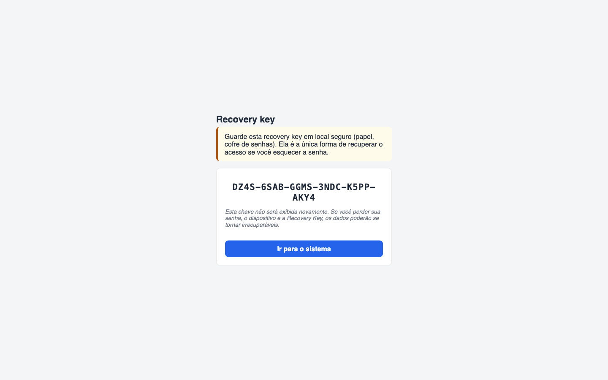

> ⚠️ **IMPORTANTE**: Guarde a recovery key em local seguro (papel, cofre de senhas). Ela é a **única forma** de recuperar o acesso caso a senha seja esquecida. O sistema não armazena sua senha — apenas uma chave derivada via Argon2id.

### Segurança técnica

- A senha é usada para derivar uma chave via **Argon2id** (key derivation function)
- Uma **VaultKey** aleatória é gerada e encapsulada (wrapped) com a chave derivada
- O banco de dados principal é cifrado com **SQLCipher** (AES-256)
- A VaultKey permanece em memória apenas enquanto o sistema está desbloqueado

---

## 5. Tela de Bloqueio e Desbloqueio

O sistema bloqueia automaticamente após 10 minutos de inatividade, ou manualmente via botão **Bloquear** na barra de navegação.

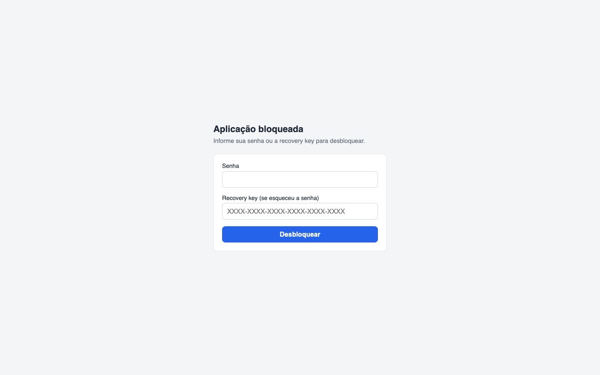

### Desbloqueio

1. Informe a **senha** ou a **recovery key**
2. Clique em **Desbloquear**

O vault é desbloqueado e a VaultKey é carregada em memória, permitindo acesso aos dados cifrados.

### Bloqueio manual

- Clique no botão **Bloquear** na barra de navegação superior
- Todas as rotas são interceptadas pelo middleware `VaultLockMiddleware`
- A VaultKey é removida da memória

---

## 6. Dashboard — Lista de Eventos

A tela principal exibe todos os eventos financeiros registrados, ordenados por data (mais recente primeiro).

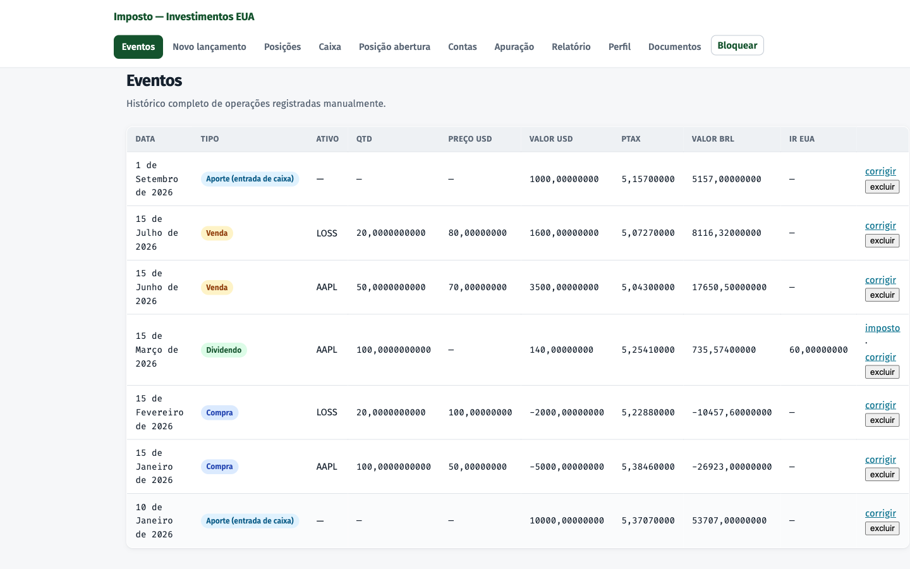

### Colunas da tabela

| Coluna | Descrição |
|--------|-----------|
| Data | Data do fato gerador (trade_date) |
| Tipo | APORTE, Compra (BUY), Venda (SELL), Dividendo, etc. |
| Ativo | Ticker do ativo (ex.: AAPL) ou "—" para aportes |
| Quantidade | Número de ações/cotas |
| Preço USD | Preço unitário em dólares |
| Valor USD | Valor total em dólares |
| PTAX | Cotação PTAX usada na conversão |
| Valor BRL | Valor convertido em reais |

### Navegação

A barra superior contém links para todas as funcionalidades:

- **Eventos** — Lista principal (dashboard)
- **Novo lançamento** — Criar evento financeiro
- **Posições** — Carteira por ativo
- **Caixa** — Saldo de caixa por conta
- **Posição abertura** — Importar posição pré-existente
- **Contas** — Gerenciar contas de corretora
- **Apuração** — Motor tributário anual
- **Relatório** — DIRPF com dados prontos
- **Perfil** — Dados do contribuinte
- **Documentos** — Upload cifrado de documentos
- **Bloquear** — Trava o vault imediatamente

---

## 7. Perfil do Contribuinte

Registra os dados pessoais do contribuinte para fins fiscais.

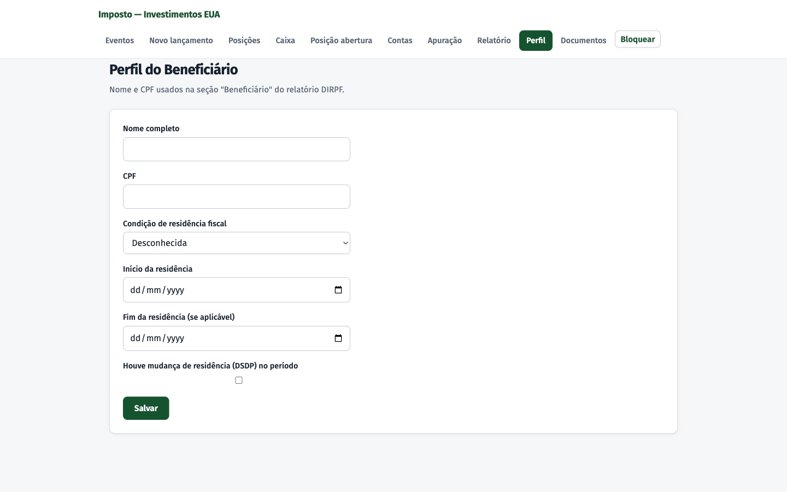

### Campos

| Campo | Descrição | Obrigatório |
|-------|-----------|:-----------:|
| Nome completo | Nome conforme documento | Sim |
| CPF | CPF do contribuinte | Sim |
| Condição de residência fiscal | BRAZIL_RESIDENT, NON_RESIDENT, UNKNOWN | Não |
| Início da residência | Data de início da residência fiscal no Brasil | Não |
| Fim da residência | Data de término (se aplicável) | Não |
| DSDP | Se houve mudança de residência fiscal no período | Não |

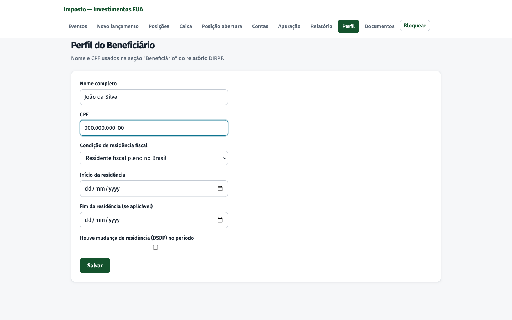

Após salvar:

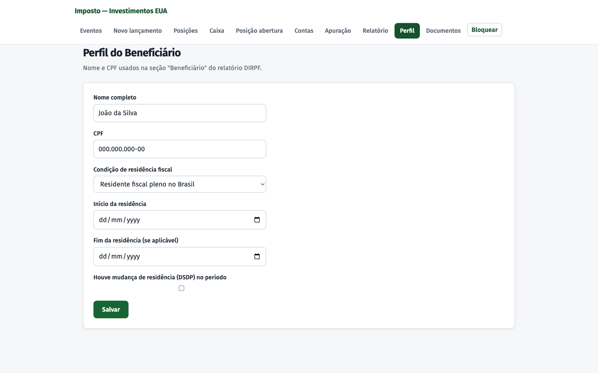

> **Nota**: O perfil é singleton — existe apenas um registro. A condição de residência impacta as validações do `AnnualClosingValidator`.

---

## 8. Contas (Caixas)

Gerencia contas de corretora/banco no exterior. Cada conta funciona como um "caixa" independente.

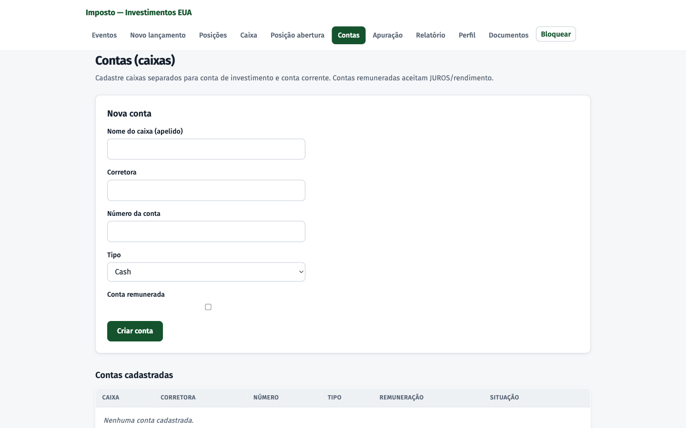

### Cadastro de nova conta

| Campo | Descrição |
|-------|-----------|
| Nome do caixa (apelido) | Identificação interna da conta |
| Corretora | Nome da instituição financeira |
| Número da conta | Número/identificador da conta |
| Tipo | CASH (à vista), CUSTODY (custódia), MARGIN (margem) ou OTHER (outro) |
| Conta remunerada | Se a conta paga juros sobre saldo |

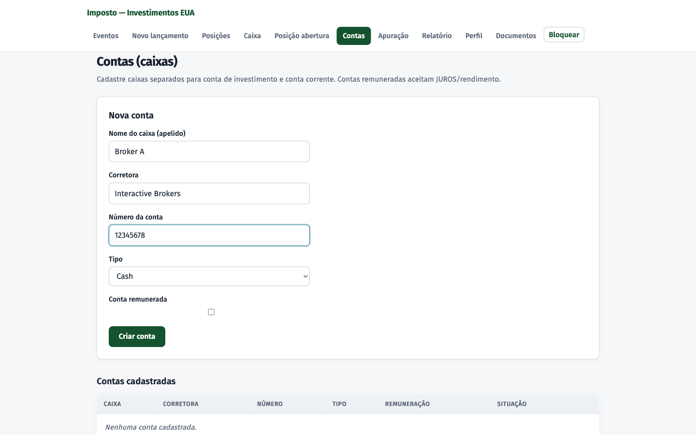

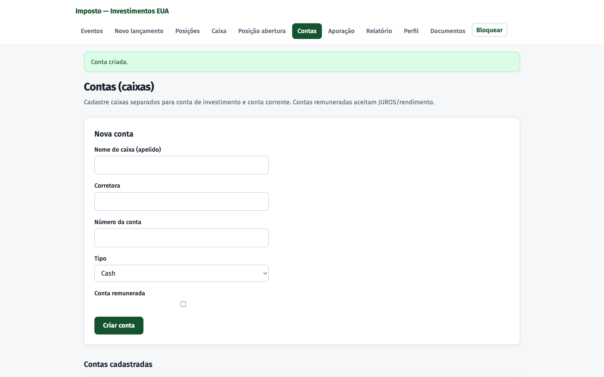

### Operações

- **Editar**: Altera dados cadastrais da conta
- **Desativar**: Remove a conta da lista ativa, preservando o histórico

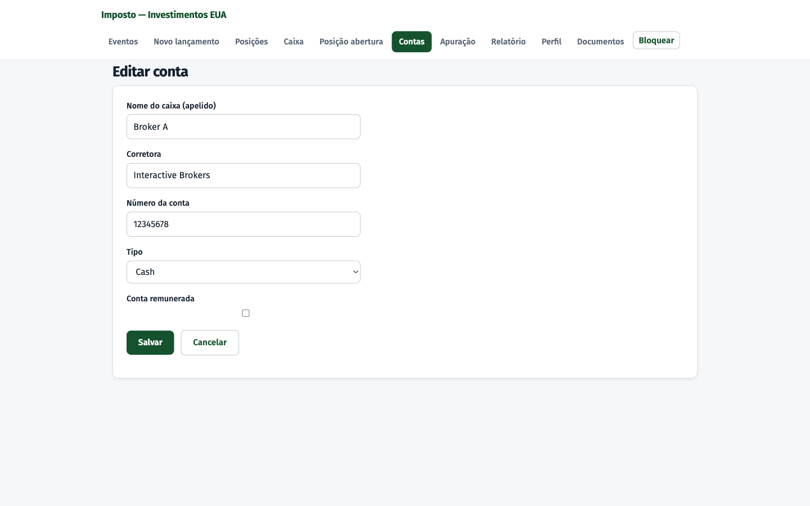

> **Regra**: Desativar uma conta **não apaga o passado fiscal dela** — contas desativadas que tiveram atividade no ano-calendário (eventos, posição de abertura, custódia ou caixa ≠ 0 na data-base) continuam entrando nos históricos da apuração e da reconciliação. Formulários de entrada (eventos, importação) continuam restritos a contas ativas.

> **Regra**: Com algum ano fechado em que a conta participou, alterar os campos de titularidade (`ownership_type`, `ownership_share`) ou a condição de conta remunerada (`is_interest_bearing`) é **bloqueado** — reabra o ano antes ([Ciclo de Vida Multi-Anos](#21-ciclo-de-vida-multi-anos-e-backup)). O apelido e demais dados descritivos permanecem editáveis.

> **Regra**: Contas **não remuneradas** têm seus juros automaticamente isentos conforme a política fiscal (`fx_cash_policy.non_bearing_cash_exempt`).

### Importação de extrato (CSV)

Cada conta ativa oferece a rota `contas/<id>/importar/` para importar extratos CSV (formato Schwab).

#### Como funciona

1. Selecione o arquivo CSV — o sistema exibe uma **pré-visualização** das linhas antes de gravar
2. Confirme a importação — o lote é gravado atomicamente (falha em uma linha revoga tudo)
3. Ações suportadas: **Buy** (compra), **Dividend** e **Reinvest Dividend** (dividendos)
4. Ações não suportadas (Sell, Transfer) são **ignoradas** na pré-visualização

> **Deduplicação**: cada arquivo é identificado pelo hash SHA-256 do conteúdo. Reimportar o mesmo arquivo é idempotente — o lote existente é retornado sem criar eventos duplicados.

> **Pré-condição**: o ativo referenciado pelo CSV deve estar previamente cadastrado (ver seção 9); linhas com ativo desconhecido falham com mensagem clara.

---

## 9. Cadastro de Ativos

Registra os ativos financeiros (ações, ETFs, REITs, etc.) negociados.

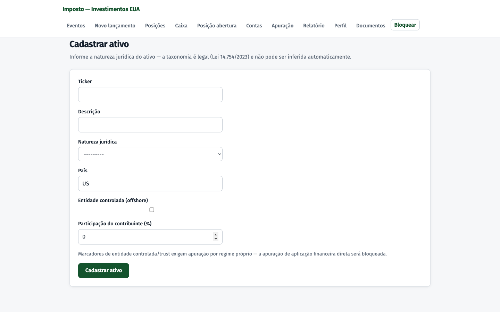

### Campos

| Campo | Descrição |
|-------|-----------|
| Ticker | Código do ativo na bolsa (ex.: AAPL, VOO) |
| Descrição | Nome descritivo do ativo |
| Natureza jurídica | FOREIGN_EQUITY (ação estrangeira), FOREIGN_ETF (ETF estrangeiro), REIT, US_TREASURY (Treasury americano), FOREIGN_BOND (título de dívida estrangeiro), FOREIGN_FUND (fundo estrangeiro), CONTROLLED_ENTITY (entidade controlada/offshore), TRUST, UNKNOWN (desconhecida) |
| País | Código ISO do país (ex.: US) |
| Entidade controlada (offshore) | Indica se o ativo é uma entidade controlada |
| Participação do contribuinte (%) | Percentual de titularidade |

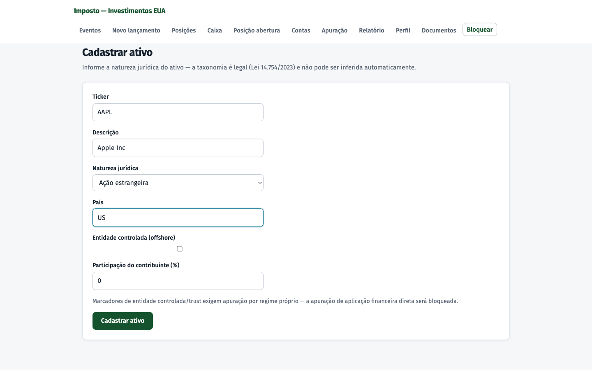

> **Nota**: Todo ativo é cadastrado **explicitamente** — não há criação automática por ticker. Eventos que referenciam um ticker inexistente são rejeitados no formulário. Ativos com tipo `UNKNOWN`, `CONTROLLED_ENTITY` ou `TRUST` bloqueiam a apuração e o fechamento do ano (TaxEngine e `AnnualClosingValidator`).

---

## 10. Lançamento de Eventos Financeiros

Tela central para registro de todas as operações financeiras.

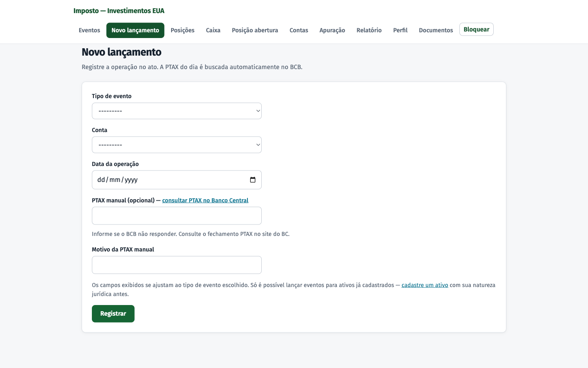

### Tipos de evento

| Tipo | Descrição | Campos específicos |
|------|-----------|-------------------|
| **APORTE** | Entrada de capital na conta | `amount_usd` |
| **BUY** | Compra de ativo | `asset_ticker`, `quantity`, `price_usd`, `fee_usd` |
| **SELL** | Venda de ativo | `asset_ticker`, `quantity`, `price_usd`, `fee_usd` |
| **DIVIDEND** | Dividendo recebido | `asset_ticker`, `quantity`, `per_share_usd`, `tax_usd` |
| **JUROS** | Rendimento de conta remunerada | `amount_usd` |
| **FEE** | Taxa cobrada pela corretora | `amount_usd` |
| **TAX_WITHHELD** | Imposto retido nos EUA (lançamento avulso) | `amount_usd` |
| **WITHDRAWAL** | Retirada de capital | `amount_usd` |
| **STOCK_SPLIT** | Desdobramento (split) — quantidade e custo unitário ajustados, custo total BRL preservado | `asset_ticker`, `split_ratio_from`, `split_ratio_to` |
| **REVERSE_SPLIT** | Grupamento (reverse split) | `asset_ticker`, `split_ratio_from`, `split_ratio_to` |
| **CASH_IN_LIEU** | Fração paga em dinheiro no split — tratada como alienação | `asset_ticker`, `quantity`, `amount_usd` |

> **Nota**: Transferências de custódia entre contas do mesmo titular (`BROKER_TRANSFER_IN/OUT`) e restituições de imposto retido no exterior (`WITHHOLDING_REFUND`) são registradas pela camada de serviço (`EventService`/`BrokerTransferService`) — não aparecem no formulário web. A transferência de custódia **não é alienação**: sai pelo custo médio do momento e entra com o mesmo valor nas duas contas.

### Exemplos do cenário de teste

#### Aporte
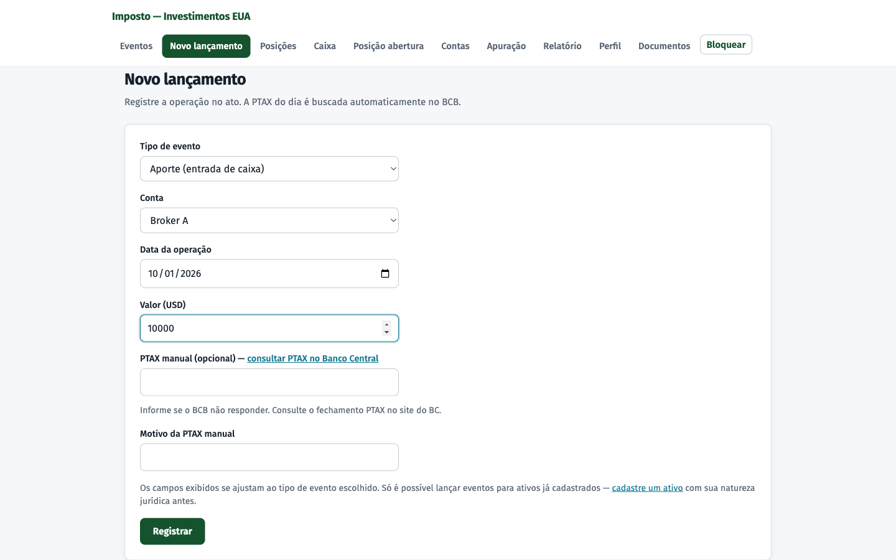

#### Compra
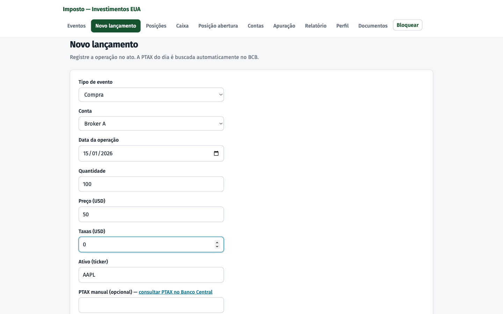

#### Dividendo (com imposto retido no exterior)
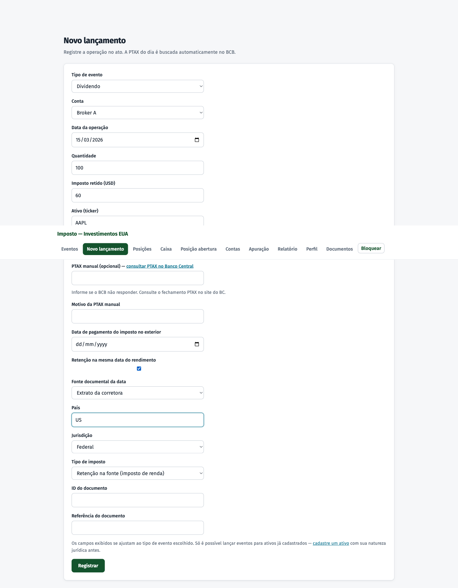

#### Venda


### Conversão cambial automática

Ao registrar um evento, o sistema:
1. Consulta a **PTAX** (BCB Olinda API) na data do fato gerador
2. Aplica a cotação de **VENDA** para rendimentos e ganhos
3. Aplica a cotação de **COMPRA** para imposto pago no exterior (na data do pagamento)
4. Se a cotação não estiver disponível, aplica fallback de até 10 dias úteis
5. Permite **override manual** da cotação se necessário

### Imposto retido no exterior (dividendos)

Para dividendos com imposto retido na fonte:
- O campo **Tax USD** registra o valor bruto retido
- O sistema cria automaticamente um `ForeignTaxPayment` vinculado
- O campo **Confirmar retenção na mesma data** indica que o pagamento do imposto foi na mesma data do rendimento
- A **jurisdição** (FEDERAL/STATE) e o **país** determinam a elegibilidade para crédito

> ⚠️ **Apenas impostos FEDERAIS de países com reciprocidade (EUA) são elegíveis para crédito de imposto exterior.**

---

## 11. Posições

Exibe a carteira consolidada do contribuinte com posição por ativo e conta.

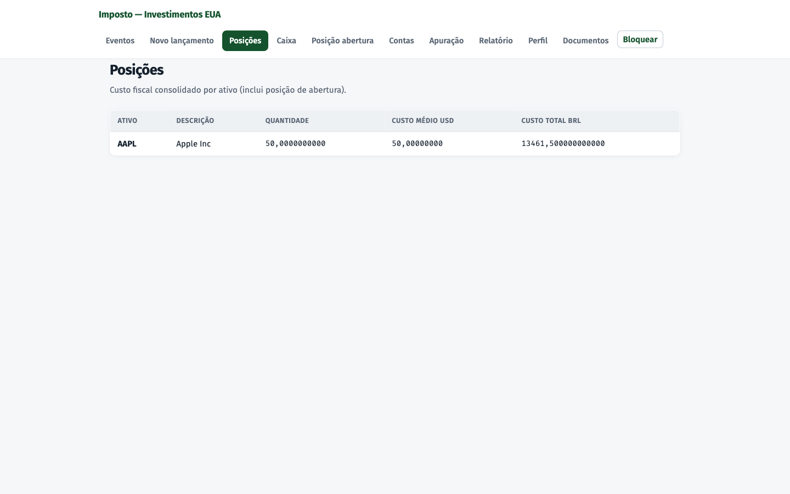

### Dados exibidos

- **Ativo/Conta**: Identificação
- **Quantidade**: Número de ações/cotas em carteira
- **Custo médio USD**: Preço médio ponderado de aquisição em dólares
- **Custo médio BRL**: Preço médio ponderado em reais (PTAX da data de cada compra)
- **Custo total BRL**: Quantidade × custo médio BRL

O cálculo de custo médio é **ponderado** pela quantidade:
```
custo_medio = Σ(quantidade_compra × preço × PTAX) / Σ(quantidade_compra)
```

---

## 12. Caixa

Exibe o histórico e saldo de caixa de cada conta.

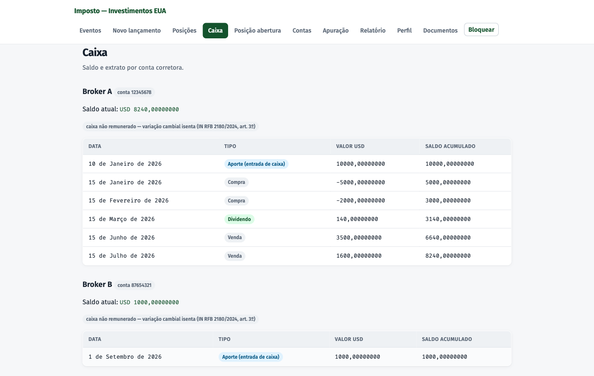

### Lógica

- **Entradas**: APORTE, SELL, DIVIDEND, JUROS (valores positivos)
- **Saídas**: BUY, WITHDRAWAL, FEE, TAX (valores negativos no `amount_usd`)
- O saldo é calculado cronologicamente: `saldo = Σ(amount_usd)`

---

## 13. Posição de Abertura

Permite importar posições pré-existentes (anteriores ao uso do sistema).

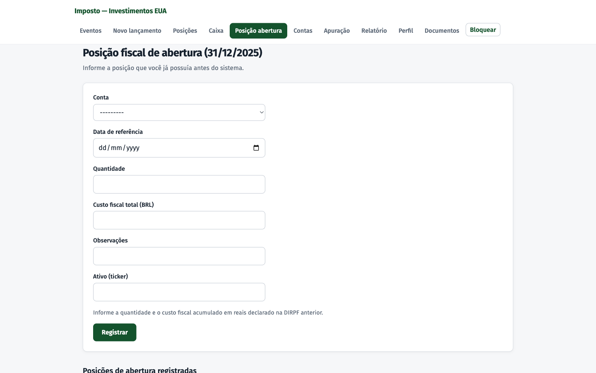

### Campos

| Campo | Descrição |
|-------|-----------|
| Ativo (ticker) | Código do ativo |
| Conta | Conta da posição |
| Data de referência | Data da posição importada |
| Quantidade | Número de ações/cotas |
| Custo fiscal total (BRL) | Custo de aquisição em reais |
| Observações | Notas livres |

> **Uso típico**: Contribuinte que já possuía investimentos antes de começar a usar o sistema. A posição de abertura define o custo-base para cálculos futuros.

> **Regra**: Com um ano fechado, criar, alterar ou remover uma posição de abertura cuja data de referência possa afetar esse ano é **bloqueado** ("Reabra o ano XXXX antes de alterar dados estruturais que afetam essa apuração") — a posição alimenta custo fiscal, custo médio e ganho/prejuízo de todos os anos posteriores à data-base. Após a reabertura, a alteração é permitida. Posições com data **futura** (ex.: 31/12/2027) não são bloqueadas pelo fechamento de um ano anterior.

---

## 14. Apuração Anual

Motor tributário que calcula o imposto devido no ano-calendário.

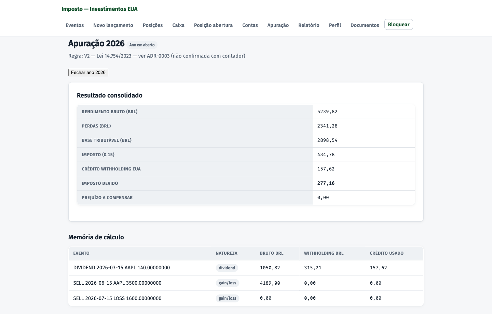

### Resultado consolidado (cenário de teste)

| Item | Valor |
|------|------:|
| Rendimento bruto (BRL) | R$ 5.239,82 |
| Perdas (BRL) | R$ 2.341,28 |
| Base tributável (BRL) | R$ 2.898,54 |
| Imposto (15%) | R$ 434,78 |
| Crédito de imposto exterior | (conforme cálculo) |
| **IR devido** | **(conforme saldo)** |

### Regra tributária

O sistema utiliza a **TaxRule V2** (Lei 14.754/2023):
- Alíquota flat de **15%** sobre rendimentos no exterior
- Crédito de imposto exterior habilitado
- Compensação de prejuízos carry-forward habilitada

### Fechar ano

O botão **Fechar ano** executa o `AnnualClosingValidator` com 20+ validações:

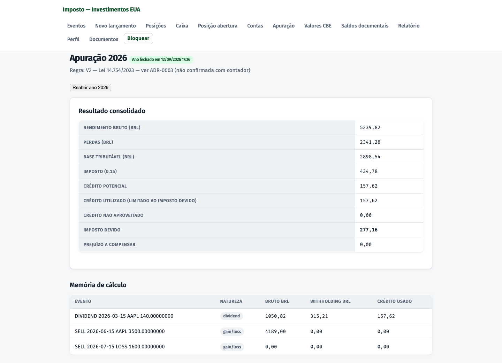

Após o fechamento, o botão **Fechar ano** desaparece (tentar fechar novamente via outra via é bloqueado no servidor) e passa a existir o botão **Reabrir ano** — veja [Ciclo de Vida Multi-Anos](#21-ciclo-de-vida-multi-anos-e-backup).

### Reabrir ano

A reabertura é formal, pela tela de Apuração (nada de SQL manual):

1. Clique em **Reabrir ano** e confirme digitando o ano-calendário
2. O snapshot de fechamento é apagado e os prejuízos consumidos por compensação naquele ano são **devolvidos ao saldo** (na mesma transação)
3. Refaça a apuração e feche o ano novamente

> ⚠️ Não é possível reabrir um ano se existem anos **posteriores** fechados — reabrir um ano anterior desfaria consumos de prejuízo em cascata. Reabra do mais recente para o mais antigo.

#### Validações bloqueantes

| Validação | Descrição |
|-----------|-----------|
| Residência fiscal confirmada | O perfil não pode estar `UNKNOWN` |
| Venda a descoberto | Não pode vender mais do que possui na data da venda |
| Ativos UNKNOWN | Todos os ativos devem ter tipo definido |
| Erros de conversão | Todas as operações devem ter PTAX válida |
| Perfil incompleto | Dados do contribuinte devem estar preenchidos |
| Regra não confirmada | TaxRule deve estar `confirmed=True` |
| Transferências solitárias | Toda transferência de custódia deve ter as duas pontas (IN/OUT) |
| Crédito não compensável | Não pode haver crédito exterior aproveitado acima do IR devido (sem carryforward de crédito — Lei 14.754/2023, art. 4º) |
| Restituição retroativa | Estorno de imposto referente a ano já fechado exige retificação da declaração de origem |

As violações são **agregadas**: todas são reportadas de uma vez, cada uma com mensagem explicativa. Para cada validação, veja o guia de [Troubleshooting — Se Algo Der Errado](#22-troubleshooting--se-algo-der-errado), com causa provável e passo a passo de correção.

---

## 15. Relatório DIRPF

Gera os dados formatados para preenchimento da Declaração de Ajuste Anual (DIRPF).

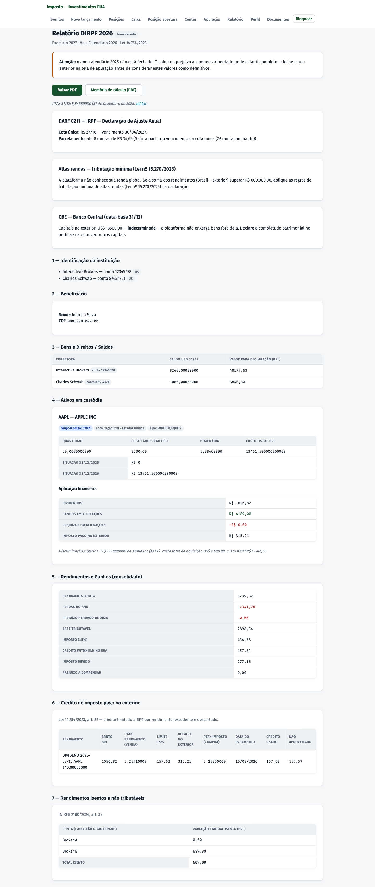

### Seções do relatório

O relatório é estruturado conforme o `DirpfSchema`:

1. **Rendimentos tributáveis** — Ganhos de capital, dividendos
2. **Bens e direitos** — Posições em 31/12 com custo fiscal
3. **Dívidas e ônus reais** — (se aplicável)
4. **Imposto pago/retido** — Crédito de imposto exterior
5. **CBE** — Obrigatoriedade da Declaração de Capitais no Exterior
6. **DARF** — Orientação de pagamento (código 0211)
7. **Altas rendas** — Tributação mínima (Lei 15.270/2025, a partir de 2026)

### Formatos de saída

- **HTML**: Visualização no browser (tela principal)
- **PDF**: Download do relatório formatado (`/relatorio/<ano>/pdf`)
- **Memória de cálculo PDF**: Demonstrativo detalhado (`/relatorio/<ano>/memoria-pdf`)

---

## 16. PTAX de Fechamento

Para datas futuras ou sem cotação disponível no BCB, o sistema solicita a PTAX de fechamento (31/12) manualmente.

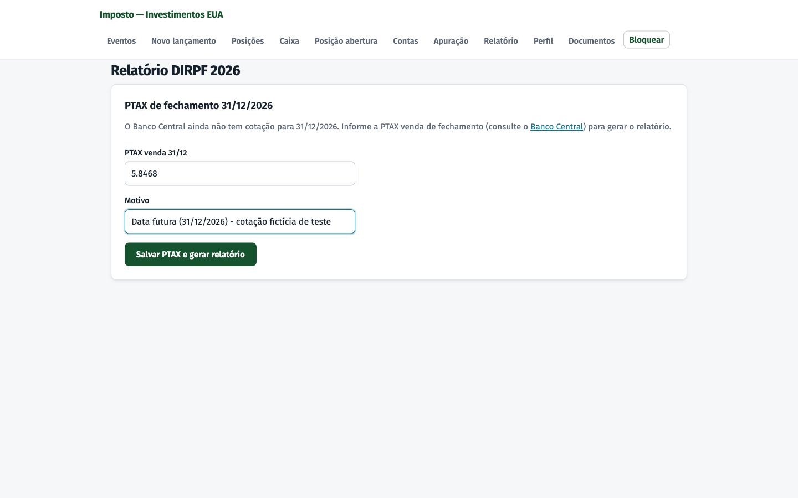

### Procedimento

1. O sistema detecta que a PTAX de 31/12 do ano-calendário não está disponível
2. Exibe formulário solicitando a cotação PTAX Venda
3. Preencha o valor e o motivo
4. O sistema registra como `manual_override` e recalcula o relatório

> **Nota**: A PTAX de fechamento é necessária para calcular o patrimônio em 31/12 (posição × custo médio × PTAX).

---

## 17. Segurança

Tela de administração de segurança do vault.

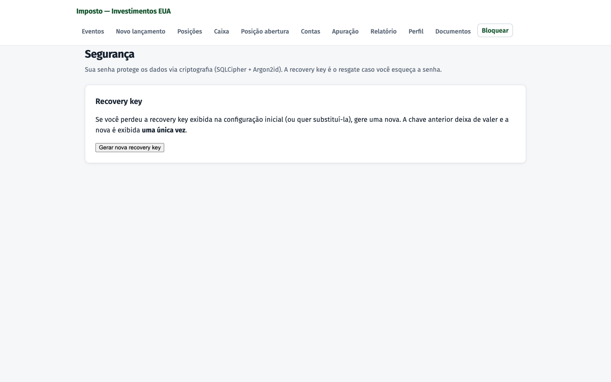

### Funcionalidades

- **Alterar senha**: Define nova senha de acesso
- **Regenerar recovery key**: Gera nova recovery key (invalida a anterior)
- **Auto-lock**: Configuração de tempo de inatividade (padrão: 10 minutos)
- **Audit log**: Registro de eventos de segurança (login, logout, erros)
- **Backup cifrado**: Exportação do banco via management command

### Backup e restore

O backup exporta o banco cifrado com a mesma chave do vault. Para o fluxo completo de backup, restore em máquina nova e verificação de integridade, veja [Ciclo de Vida Multi-Anos e Backup](#21-ciclo-de-vida-multi-anos-e-backup).

```bash
# Backup cifrado
docker compose exec app python manage.py backup_encrypted /data/backup.enc
```

---

## 18. Documentos

Upload e armazenamento cifrado de documentos comprobatórios.

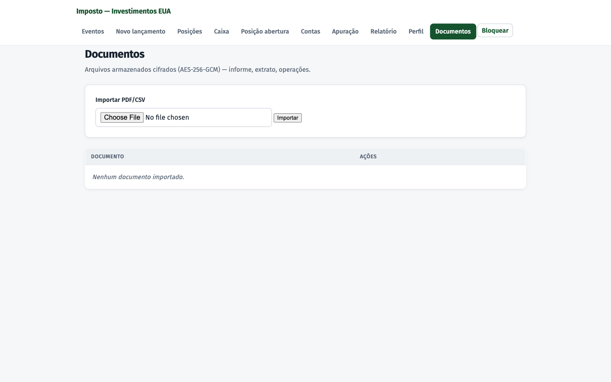

### Funcionalidades

- Upload de arquivos (extratos, comprovantes, etc.)
- Armazenamento cifrado em disco (`/data/documents/`)
- Download com descriptografia automática
- Vinculação com eventos financeiros

> **Nota**: Os documentos são cifrados individualmente com AES-GCM antes de serem gravados no disco.

---

## 19. Fluxo Completo — Passo a Passo

### Visão geral do caminho

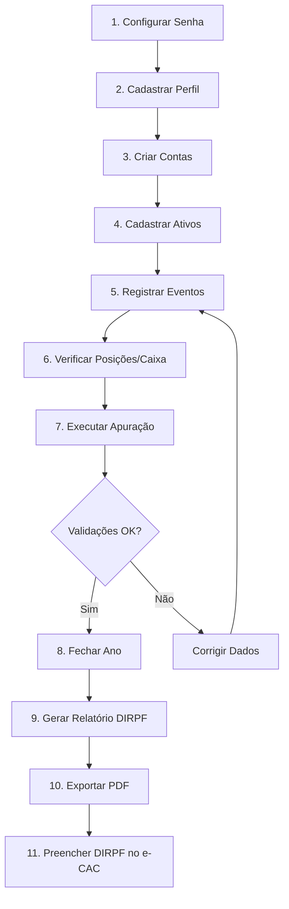
```mermaid
flowchart TD
    A[1. Configurar Senha] --> B[2. Cadastrar Perfil]
    B --> C[3. Criar Contas]
    C --> D[4. Cadastrar Ativos]
    D --> E[5. Registrar Eventos]
    E --> F[6. Verificar Posições/Caixa]
    F --> G[7. Executar Apuração]
    G --> H{Validações OK?}
    H -- Sim --> I[8. Fechar Ano]
    H -- Não --> J[Corrigir Dados]
    J --> E
    I --> K[9. Gerar Relatório DIRPF]
    K --> L[10. Exportar PDF]
    L --> M[11. Preencher DIRPF no e-CAC]
```

Abaixo, o mesmo roteiro como tutorial: cada passo diz o que fazer, o que você deve ver e o que conferir antes de avançar. O cenário usa os dados do teste de validação do sistema (João da Silva, contas A e B, ativos AAPL e LOSS) — substitua pelos seus dados reais.

### Passo 1 — Configurar a senha de acesso

Acesse `http://localhost:8000/bloqueado/` e defina uma senha forte (mínimo 8 caracteres). Ao confirmar, o sistema exibe a **recovery key**.


✅ **Você deve ver:** a tela de recovery key. **Anote-a em papel ou cofre de senhas antes de prosseguir** — ela é a única forma de recuperar o acesso se a senha for esquecida (ver [Primeiro Acesso](#4-primeiro-acesso--configuração-de-segurança)).

### Passo 2 — Cadastrar o perfil do contribuinte

Em **Perfil**, preencha nome completo e CPF (obrigatórios) e a condição de residência fiscal.


✅ **Você deve ver:** a tela confirmando os dados salvos. **Confira:** a condição de residência **não** pode ficar `UNKNOWN`, senão o fechamento do ano será bloqueado ([Perfil](#7-perfil-do-contribuinte)).

### Passo 3 — Criar as contas de corretora

Em **Contas**, crie uma conta para cada corretora. No cenário: **Conta A** (Interactive Brokers) e **Conta B** (Charles Schwab).


✅ **Você deve ver:** as duas contas listadas como ativas. **Confira:** o tipo (CASH/CUSTODY/MARGIN) e se a conta é remunerada — contas remuneradas exigem lançamentos de JUROS ([Contas](#8-contas-caixas)).

### Passo 4 — Cadastrar os ativos

Em **Cadastro de Ativos**, registre cada ticker **antes** de lançar eventos que o referenciem. No cenário: **AAPL** (FOREIGN_EQUITY) e um ativo de perda (LOSS).


✅ **Você deve ver:** os ativos listados com natureza jurídica definida. **Confira:** nenhum ativo pode ficar `UNKNOWN` — isso bloqueia a apuração ([Cadastro de Ativos](#9-cadastro-de-ativos)).

### Passo 5 — Registrar os eventos

Em **Novo lançamento**, registre as operações na ordem cronológica em que ocorreram. O cenário usa 7 eventos: aportes nas duas contas, compras de AAPL, um dividendo e vendas (incluindo uma venda com prejuízo, para demonstrar a compensação de perdas).


**Ao lançar o dividendo**, preencha o valor bruto e o imposto retido na fonte (Tax USD), marcando a confirmação da retenção na mesma data quando for o caso:


> ⚠️ **Atenção ao teto de 15%:** a retenção acima de 15% do rendimento bruto é um lançamento **válido** e **não bloqueia** o fechamento (Lei 14.754/2023, art. 4º) — mas o crédito fica limitado ao teto de 15% por rendimento: ex. dividendo de US$ 1.000 com IR de US$ 300 (30%) aproveita só US$ 150 (15%); o excedente é descartado, sem restituição nem carry-forward.


✅ **Você deve ver:** cada evento na lista do dashboard com a coluna PTAX preenchida automaticamente. **Confira:** se alguma linha mostrar erro de conversão, resolva antes de prosseguir ([Lançamento de Eventos](#10-lançamento-de-eventos-financeiros)).

> 💡 Se você já possuía investimentos antes de começar a usar o sistema, registre-os primeiro em [Posição de Abertura](#13-posição-de-abertura) — sem isso, vendas sobre a posição antiga podem parecer "venda a descoberto".

### Passo 6 — Conferir posições e caixa

Antes de apurar, valide que o sistema reflete a realidade das corretoras.


✅ **Você deve ver:** a quantidade de ações e o custo médio de cada ativo, e o saldo de caixa de cada conta. **Confira:** esses números contra o extrato da corretora — qualquer divergência agora evita retrabalho no fechamento.

### Passo 7 — Executar a apuração anual

Em **Apuração**, selecione o ano-calendário e execute o cálculo. No cenário: rendimento bruto de R$ 5.239,82, perdas de R$ 2.341,28, base de R$ 2.898,54 e IR de R$ 434,78.


✅ **Você deve ver:** o resultado consolidado com o imposto a 15%. Se a TaxRule do ano ainda não estiver confirmada, confirme-a nesta tela.

### Passo 8 — Fechar o ano

Clique em **Fechar ano**. O validador executa todas as verificações e reporta violações agregadas, se houver.


✅ **Você deve ver:** a confirmação do fechamento. **Se aparecerem violações:** elas listam tudo de uma vez — resolva cada uma com o guia de [Troubleshooting](#22-troubleshooting--se-algo-der-errado) e repita. Após fechar, o ano fica selado ([Ciclo de Vida Multi-Anos](#21-ciclo-de-vida-multi-anos-e-backup)).

### Passo 9 — Gerar o Relatório DIRPF

Em **Relatório**, gere os dados formatados para a declaração do ano fechado. Se a PTAX de 31/12 não estiver disponível, o sistema solicitará a cotação manual ([PTAX de Fechamento](#16-ptax-de-fechamento)) antes de finalizar.


✅ **Você deve ver:** todas as seções preenchidas — rendimentos, bens e direitos, imposto pago/retido, CBE, DARF e altas rendas.

### Passo 10 — Exportar e entregar

Baixe o **PDF** do relatório e a **memória de cálculo** para os comprovantes. Com os valores em mãos, preencha a DIRPF no e-CAC (e a CBE no BCB, se sinalizada como obrigatória).

✅ **Checklist final:** relatório em PDF baixado, memória de cálculo arquivada, DARF 0211 agendado para pagamento até o último dia útil de abril, e backup cifrado feito ([Backup](#213-backup--exportar-os-dados-cifrados)).

### Resumo do cenário de teste

| Passo | Ação | Resultado |
|-------|------|-----------|
| 1 | Configurar senha `TesteSenha2026!` | ✅ Recovery key gerada |
| 2 | Cadastrar perfil (João da Silva, CPF 000.000.000-00) | ✅ Perfil salvo |
| 3 | Criar Conta A (Interactive Brokers) e Conta B (Charles Schwab) | ✅ 2 contas ativas |
| 4 | Cadastrar ativos AAPL e LOSS | ✅ 2 ativos registrados |
| 5 | Registrar 7 eventos (aportes, compras, dividendo, vendas) | ✅ Todos com PTAX automática |
| 6 | Verificar posições (AAPL: 50 ações restantes) | ✅ Custo médio correto |
| 7 | Executar apuração 2026 | ✅ IR calculado: R$ 434,78 |
| 8 | Fechar ano 2026 | ✅ Validações aprovadas |
| 9 | Gerar relatório DIRPF | ✅ Todas as seções geradas |
| 10 | Verificar persistência (lock/unlock) | ✅ Dados preservados |

---

## 20. Regras de Negócio

### Lei 14.754/2023 — Tributação de aplicações financeiras no exterior

| Regra | Implementação |
|-------|---------------|
| **Alíquota** | 15% flat sobre rendimentos no exterior |
| **Fato gerador** | Data da alienação, recebimento ou resgate |
| **Conversão cambial** | PTAX Venda BCB na data do fato gerador |
| **Imposto exterior** | PTAX Compra BCB na data do pagamento |
| **Compensação de perdas** | Carry-forward multianual (FIFO) |
| **Crédito de imposto** | Limitado ao IR devido; Federal + reciprocidade |
| **CBE** | Capitais ≥ US$ 1M: anual; ≥ US$ 100M: trimestral |
| **DARF 0211** | Vencimento pela FilingRule do exercício (padrão: último dia útil de abril); < R$ 10 = adiamento ao período seguinte (art. 938, §§ 4º/5º, RIR/2018) |
| **Altas rendas** | Lei 15.270/2025: renda global > R$ 600k (a partir de 2026) |

### Regras de PTAX por componente

| Componente | Data fiscal | Cotação BCB |
|------------|-------------|-------------|
| Aquisição | Data da compra | VENDA |
| Alienação | Data da venda | VENDA |
| Rendimento | Data do recebimento | VENDA |
| Imposto exterior | Data do pagamento | **COMPRA** |

### Países com reciprocidade

Apenas **Estados Unidos (US)** — permite crédito de imposto federal retido.

---

## 21. Ciclo de Vida Multi-Anos e Backup

### 21.1 O que acontece quando o ano é fechado

Fechar um ano-calendário **sela** a apuração daquele período: os números do ano ficam imutáveis e o Relatório DIRPF correspondente pode ser consultado e reexportado quando necessário. Alterações retroativas só são possíveis **reabrindo o ano formalmente** (botão **Reabrir ano** na Apuração — ver [Reabrir ano](#reabrir-ano)).

O que fica bloqueado enquanto o ano estiver fechado:

- **Eventos fiscais** do ano: criar, corrigir ou desativar lançamentos; editar imposto retido no exterior; registrar transferências de custódia
- **PTAX**: override manual de cotação de data do ano fechado
- **Dados estruturais**: criar/alterar/remover [posição de abertura](#13-posição-de-abertura) cuja data-base afete o ano; alterar titularidade (`ownership_type`, `ownership_share`) ou conta remunerada (`is_interest_bearing`) de conta que participou do ano — dados descritivos (apelido) permanecem editáveis

A reabertura apaga o snapshot do fechamento e **devolve ao saldo** os prejuízos consumidos por compensação naquele ano. Após corrigir os dados, feche o ano novamente.

Consequências práticas:

- **Restituição retroativa** (estorno de imposto de um ano fechado) exige retificação da declaração de origem — o validador bloqueia se você tentar lançá-la no ano corrente (ver [Troubleshooting](#22-troubleshooting--se-algo-der-errado))
- O relatório e a memória de cálculo do ano fechado continuam disponíveis para consulta e download

### 21.2 O ano seguinte com carry-forward de perdas

Você não precisa fazer nada especial para levar perdas para o ano seguinte — o sistema compensa automaticamente (FIFO, sem expiração). O que muda no novo ano:

1. O saldo de prejuízo do ano fechado entra automaticamente na apuração do ano novo
2. Os rendimentos do novo ano acumulam do zero
3. A posição de 31/12 do ano fechado vira o ponto de partida das posições do ano novo

**Exemplo numérico:**

| | Ano 1 (fechado) | Ano 2 |
|---|----------------:|------:|
| Ganho de capital + rendimentos | R$ 1.000 | R$ 3.000 |
| Perdas do próprio ano | R$ 2.000 | — |
| Base tributável | R$ 0 | R$ 3.000 − R$ 1.000 (carry-forward) = **R$ 2.000** |
| IR devido (15%) | R$ 0 | **R$ 300** |

Após a apuração do ano 2, basta repetir o fluxo: [Apuração](#14-apuração-anual) → conferir validações → **Fechar ano** → [Relatório DIRPF](#15-relatório-dirpf).

### 21.3 Backup — exportar os dados cifrados

O backup exporta o banco de dados **cifrado** com a mesma chave do vault — o arquivo é inútil sem a sua senha/recovery key:

```bash
# Backup cifrado
docker compose exec app python manage.py backup_encrypted /data/backup.enc
```

**Rotina recomendada:** faça backup após cada fechamento de ano e a cada lote relevante de lançamentos. Guarde o `backup.enc` fora da máquina (pendrive, cofre de arquivos) junto de um registro da **recovery key**.

### 21.4 Restore — restaurar em máquina nova

Para migrar de máquina ou recuperar de perda:

1. **Instale o sistema** na máquina nova (ver [Requisitos e Instalação](#3-requisitos-e-instalação)) — não complete o setup de segurança ainda
2. **Copie o backup** para o volume de dados do container (ex.: o diretório mapeado para `/data`)
3. **Restaure** com o comando correspondente do management command de restore, apontando para o `backup.enc`
4. **Desbloqueie** com a senha da época do backup (a VaultKey restaurada é a mesma — senhas definidas depois do backup não abrem os dados restaurados)
5. **Verifique a integridade:** acesse [Posições](#11-posições), [Caixa](#12-caixa) e a última [Apuração](#14-apuração-anual) fechada — os valores devem bater com o registro da época do backup

> ⚠️ Sem a senha **ou** a recovery key da época do backup, os dados são irrecuperáveis por design — a criptografia não tem "backdoor". Por isso a rotina recomendada guarda a recovery key junto do backup.

---

## 22. Troubleshooting — Se Algo Der Errado

### 22.1 O botão "Fechar ano" me mostrou uma lista de erros

Ao clicar em **Fechar ano**, o `AnnualClosingValidator` executa todas as validações e as reporta **de uma vez** — cada violação aparece com uma mensagem explicativa. Isso é esperado: o sistema prefere listar tudo do que fazer você corrigir um item por vez. Abaixo, cada validação com sua causa provável e a correção.

| Validação | Mensagem típica | Causa provável | Como corrigir |
|-----------|-----------------|----------------|---------------|
| Residência fiscal | Perfil com condição `UNKNOWN` | Perfil cadastrado mas condição de residência não informada | [Perfil](#7-perfil-do-contribuinte): preencha "Condição de residência fiscal" e, se aplicável, datas de início/fim |
| Venda a descoberto | Venda maior que a posição na data | Evento de venda com quantidade acima do que você possuía (erro de digitação, evento duplicado ou posição de abertura faltante) | Confira o evento na lista; corrija a quantidade ou cadastre a [Posição de Abertura](#13-posição-de-abertura) que antecede a venda |
| Ativos UNKNOWN | Tipo de ativo não definido | Ativo cadastrado com natureza `UNKNOWN` (ou `CONTROLLED_ENTITY`/`TRUST`) | [Cadastro de Ativos](#9-cadastro-de-ativos): defina a natureza jurídica correta — esses tipos bloqueiam apuração |
| Erros de conversão | PTAX ausente para a data | Cotação indisponível no BCB (data futura, fim de semana sem fallback) | Aguarde a cotação ser publicada ou use o override manual do evento; PTAX de 31/12 é solicitada em formulário próprio ([PTAX de Fechamento](#16-ptax-de-fechamento)) |
| Perfil incompleto | Dados do contribuinte ausentes | Nome ou CPF vazios | [Perfil](#7-perfil-do-contribuinte): preencha nome completo e CPF |
| Regra não confirmada | TaxRule não confirmada | Regra tributária do ano ainda sem confirmação | Confirme a TaxRule na tela de Apuração antes de fechar o ano |
| Transferências solitárias | Transferência sem contraparte | `BROKER_TRANSFER_IN` sem o `OUT` correspondente (ou vice-versa) | Registre as duas pontas da transferência de custódia — a camada de serviço exige o par |
| Retenção acima do limite | Imposto exterior > 15% do rendimento | Retenção na fonte acima de 15% do rendimento bruto (ex.: 30% retido sobre dividendo) | O lançamento é válido e **não bloqueia** o fechamento (Lei 14.754/2023, art. 4º) — o crédito fica limitado ao teto de 15% por rendimento e o excedente é descartado. Aparece no relatório como "Crédito não aproveitado" |
| Crédito não compensável | Crédito acima do IR devido | Crédito exterior aproveitado excedendo o imposto brasileiro | Não há carry-forward de crédito (Lei 14.754/2023, art. 4º). Revise os lançamentos de retenção; o crédito é limitado ao IR devido |
| Restituição retroativa | Estorno em ano fechado | `WITHHOLDING_REFUND` referente a imposto de ano já fechado | Exige retificação da declaração de origem — não é possível incluir no ano corrente; consulte seu contador |
| Ano fechado | "Reabra o ano XXXX antes de alterar…" | Tentativa de criar/corrigir evento, PTAX, posição de abertura ou titularidade atingindo ano confirmado | [Reabra o ano](#reabrir-ano) (do mais recente para o mais antigo), corrija os dados e feche novamente |

### 22.2 Outros erros comuns

**"Ativo não cadastrado" ao importar CSV** — o importador de extratos não cria ativos automaticamente. Cadastre o ticker em [Cadastro de Ativos](#9-cadastro-de-ativos) e repita a importação (o arquivo é idempotente por hash SHA-256 — nada será duplicado).

**PTAX indisponível ao lançar evento** — o sistema tenta um fallback de até 10 dias úteis. Se ainda assim falhar (data muito recente ou feriado prolongado), use o override manual da cotação no formulário do evento, registrando o motivo.

**"Servidor travado. Desbloqueie em /bloqueado/"** — o vault foi bloqueado por inatividade (10 min por padrão). É o comportamento de segurança esperado, não um erro. Desbloqueie com senha ou recovery key ([Bloqueio e Desbloqueio](#5-tela-de-bloqueio-e-desbloqueio)).

**Erros 500 na tela de configuração inicial** — se a configuração de segurança falhar com erro, verifique os logs do container (`docker compose logs app`) e confirme que o volume `/data` está gravável. Se o problema persistir, é candidata a bug: registre com o log completo.

### 22.3 Checklist antes de fechar o ano

Para minimizar surpresas, antes de clicar em **Fechar ano** confirme:

1. Perfil completo, com condição de residência ≠ `UNKNOWN`
2. Todos os ativos com natureza jurídica definida (nenhum `UNKNOWN`)
3. Nenhuma venda acima da posição possuída na data
4. Todas as transferências de custódia com as duas pontas
5. Retenções exteriores classificadas (jurisdição federal, tipo e caráter definitivo) — retenção acima do teto de 15% é válida e não bloqueia; só reduz o crédito aproveitável
6. TaxRule do ano confirmada
7. [Posições](#11-posições) e [Caixa](#12-caixa) conferidos com o extrato da corretora

---

## 23. Glossário

| Termo | Definição |
|-------|-----------|
| **PTAX** | Taxa de câmbio de referência divulgada pelo Banco Central do Brasil |
| **DARF** | Documento de Arrecadação de Receitas Federais |
| **DIRPF** | Declaração de Imposto de Renda Pessoa Física |
| **CBE** | Declaração de Capitais Brasileiros no Exterior |
| **DSDP** | Declaração de Saída Definitiva do País |
| **SQLCipher** | Extensão de criptografia para SQLite (AES-256) |
| **Argon2id** | Função de derivação de chave resistente a ataques de hardware |
| **VaultKey** | Chave simétrica aleatória usada para cifrar o banco de dados |
| **Carry-forward** | Transporte de prejuízo para compensação em anos futuros |
| **FIFO** | First-In, First-Out — ordem de compensação de perdas |
| **Custo médio** | Preço médio ponderado de aquisição de um ativo |
| **Fato gerador** | Evento que dá origem à obrigação tributária |

---

## 24. Referências Legais

| Norma | Assunto |
|-------|---------|
| Lei nº 14.754/2023 | Tributação de aplicações financeiras no exterior |
| IN RFB nº 2.180/2024 | Regulamentação da Lei 14.754/2023 |
| Lei nº 15.270/2025 | Tributação mínima de altas rendas |
| Resolução BCB nº 279/2022 | CBE — Capitais Brasileiros no Exterior |
| Decreto nº 9.580/2018 (RIR) | Regulamento do Imposto de Renda |
| Art. 938, §§ 4º e 5º, RIR/2018 | Vedação de DARF < R$ 10,00 e acúmulo nos períodos subsequentes |

---

> **Aviso**: Este sistema é uma ferramenta auxiliar de cálculo. Os valores devem ser validados por um contador antes do preenchimento da DIRPF. O desenvolvedor não se responsabiliza por erros de cálculo ou interpretação da legislação.
