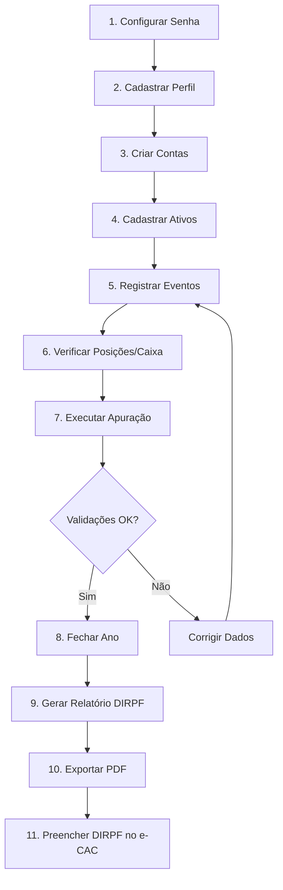

# Manual do Sistema — FiscoAtlas

> **Versão:** 1.1 (atualizada para o sistema v0.5.0)  
> **Data:** 07/09/2026  
> **Sistema:** FiscoAtlas — Imposto sobre Investimentos no Exterior (EUA)  
> **Base legal:** Lei nº 14.754/2023, IN RFB 2.180/2024, Lei nº 15.270/2025

---

## Sumário

1. [Visão Geral](#1-visão-geral)
2. [Requisitos e Instalação](#2-requisitos-e-instalação)
3. [Primeiro Acesso — Configuração de Segurança](#3-primeiro-acesso--configuração-de-segurança)
4. [Tela de Bloqueio e Desbloqueio](#4-tela-de-bloqueio-e-desbloqueio)
5. [Dashboard — Lista de Eventos](#5-dashboard--lista-de-eventos)
6. [Perfil do Contribuinte](#6-perfil-do-contribuinte)
7. [Contas (Caixas)](#7-contas-caixas)
8. [Cadastro de Ativos](#8-cadastro-de-ativos)
9. [Lançamento de Eventos Financeiros](#9-lançamento-de-eventos-financeiros)
10. [Posições](#10-posições)
11. [Caixa](#11-caixa)
12. [Posição de Abertura](#12-posição-de-abertura)
13. [Apuração Anual](#13-apuração-anual)
14. [Relatório DIRPF](#14-relatório-dirpf)
15. [PTAX de Fechamento](#15-ptax-de-fechamento)
16. [Segurança](#16-segurança)
17. [Documentos](#17-documentos)
18. [Fluxo Completo — Passo a Passo](#18-fluxo-completo--passo-a-passo)
19. [Regras de Negócio](#19-regras-de-negócio)
20. [Glossário](#20-glossário)
21. [Referências Legais](#21-referências-legais)

---

## 1. Visão Geral

O **FiscoAtlas** é um sistema web local (*local-first*) para apuração de imposto de renda sobre investimentos no exterior (EUA), conforme a **Lei nº 14.754/2023**. Ele funciona inteiramente na máquina do contribuinte, sem envio de dados para servidores externos.

### Principais funcionalidades

| Funcionalidade | Descrição |
|----------------|-----------|
| **Cadastro de eventos** | Registro de aportes, compras, vendas, dividendos, juros, taxas, retiradas, splits e frações em dinheiro |
| **Importador de extrato CSV** | Importação idempotente (SHA-256) de extratos Schwab por conta |
| **Transferência de custódia** | Movimentação de ativos/caixa entre contas do mesmo titular sem alienação fiscal |
| **Conversão cambial automática** | Cotação PTAX (BCB Olinda API) automática na data do fato gerador |
| **Apuração fiscal** | Motor tributário com alíquota flat de 15% (Lei 14.754/2023) |
| **Compensação de perdas** | FIFO multianual com carry-forward automático |
| **Crédito de imposto exterior** | Limitado ao IR devido, apenas impostos federais de países com reciprocidade |
| **Relatório DIRPF** | Dados formatados para preenchimento da Declaração de Ajuste Anual |
| **Segurança** | Dados cifrados em repouso com SQLCipher (AES-256-GCM + Argon2id) |
| **CBE** | Avaliação da obrigatoriedade da Declaração de Capitais no Exterior |
| **DARF 0211** | Orientação de pagamento com cálculo de parcelas e dispensa legal |

### Arquitetura

```
┌────────────────────────────────────────────────────┐
│  Browser (Chrome/Firefox)                          │
│  http://localhost:8000                             │
└────────────────┬───────────────────────────────────┘
                 │ HTTP
┌────────────────▼───────────────────────────────────┐
│  Django 5.1.4 (container Docker)                   │
│  ┌──────────┐ ┌──────────┐ ┌──────────┐ ┌──────┐  │
│  │ security │ │  ledger  │ │  fiscal  │ │  fx  │  │
│  │ (vault)  │ │ (events) │ │ (engine) │ │(ptax)│  │
│  └──────────┘ └──────────┘ └──────────┘ └──────┘  │
│       │              │            │          │     │
│  ┌────▼──────┐  ┌────▼────────────▼──────────▼──┐  │
│  │vault.db   │  │     db.sqlite3 (SQLCipher)    │  │
│  │(plaintext)│  │     AES-256-GCM cifrado       │  │
│  └───────────┘  └───────────────────────────────┘  │
└────────────────────────────────────────────────────┘
```

---

## 2. Requisitos e Instalação

### Pré-requisitos

- **Docker** ≥ 24.0 e **Docker Compose** ≥ 2.20
- Porta **8000** disponível no host
- Navegador web moderno (Chrome, Firefox, Safari)

### Instalação

```bash
# 1. Clonar o repositório
git clone <repo-url> FiscoAtlas && cd FiscoAtlas

# 2. Verificar/ajustar variáveis de ambiente
cat .env     # APP_PORT=8000, SECRET_KEY, etc.

# 3. Build e inicialização
docker compose up -d --build

# 4. Verificar saúde do container
docker compose ps   # Status: healthy
docker compose logs app | tail -5
# → "Servidor travado. Desbloqueie em http://127.0.0.1:8000/bloqueado/"
```

O sistema executa automaticamente:
- Migrations do Django
- Seed das regras tributárias (2024–2026, V1 e V2)
- Inicialização do servidor em http://localhost:8000

---

## 3. Primeiro Acesso — Configuração de Segurança

No primeiro acesso, o sistema exibe a tela de **configuração inicial de segurança**.


### Procedimento

1. Acesse `http://localhost:8000/bloqueado/`
2. O sistema detecta que o vault não está configurado e exibe o formulário de setup
3. Defina uma **senha forte** (mínimo 8 caracteres)
4. Confirme a senha
5. Clique em **Configurar**

### Recovery Key

Após a configuração, o sistema gera e exibe uma **recovery key** única:


> ⚠️ **IMPORTANTE**: Guarde a recovery key em local seguro (papel, cofre de senhas). Ela é a **única forma** de recuperar o acesso caso a senha seja esquecida. O sistema não armazena sua senha — apenas uma chave derivada via Argon2id.

### Segurança técnica

- A senha é usada para derivar uma chave via **Argon2id** (key derivation function)
- Uma **VaultKey** aleatória é gerada e encapsulada (wrapped) com a chave derivada
- O banco de dados principal é cifrado com **SQLCipher** (AES-256)
- A VaultKey permanece em memória apenas enquanto o sistema está desbloqueado

---

## 4. Tela de Bloqueio e Desbloqueio

O sistema bloqueia automaticamente após 10 minutos de inatividade, ou manualmente via botão **Bloquear** na barra de navegação.


### Desbloqueio

1. Informe a **senha** ou a **recovery key**
2. Clique em **Desbloquear**

O vault é desbloqueado e a VaultKey é carregada em memória, permitindo acesso aos dados cifrados.

### Bloqueio manual

- Clique no botão **Bloquear** na barra de navegação superior
- Todas as rotas são interceptadas pelo middleware `VaultLockMiddleware`
- A VaultKey é removida da memória

---

## 5. Dashboard — Lista de Eventos

A tela principal exibe todos os eventos financeiros registrados, ordenados por data (mais recente primeiro).


### Colunas da tabela

| Coluna | Descrição |
|--------|-----------|
| Data | Data do fato gerador (trade_date) |
| Tipo | APORTE, Compra (BUY), Venda (SELL), Dividendo, etc. |
| Ativo | Ticker do ativo (ex.: AAPL) ou "—" para aportes |
| Quantidade | Número de ações/cotas |
| Preço USD | Preço unitário em dólares |
| Valor USD | Valor total em dólares |
| PTAX | Cotação PTAX usada na conversão |
| Valor BRL | Valor convertido em reais |

### Navegação

A barra superior contém links para todas as funcionalidades:

- **Eventos** — Lista principal (dashboard)
- **Novo lançamento** — Criar evento financeiro
- **Posições** — Carteira por ativo
- **Caixa** — Saldo de caixa por conta
- **Posição abertura** — Importar posição pré-existente
- **Contas** — Gerenciar contas de corretora
- **Apuração** — Motor tributário anual
- **Relatório** — DIRPF com dados prontos
- **Perfil** — Dados do contribuinte
- **Documentos** — Upload cifrado de documentos
- **Bloquear** — Trava o vault imediatamente

---

## 6. Perfil do Contribuinte

Registra os dados pessoais do contribuinte para fins fiscais.


### Campos

| Campo | Descrição | Obrigatório |
|-------|-----------|:-----------:|
| Nome completo | Nome conforme documento | Sim |
| CPF | CPF do contribuinte | Sim |
| Condição de residência fiscal | BRAZIL_RESIDENT, NON_RESIDENT, UNKNOWN | Não |
| Início da residência | Data de início da residência fiscal no Brasil | Não |
| Fim da residência | Data de término (se aplicável) | Não |
| DSDP | Se houve mudança de residência fiscal no período | Não |


Após salvar:


> **Nota**: O perfil é singleton — existe apenas um registro. A condição de residência impacta as validações do `AnnualClosingValidator`.

---

## 7. Contas (Caixas)

Gerencia contas de corretora/banco no exterior. Cada conta funciona como um "caixa" independente.


### Cadastro de nova conta

| Campo | Descrição |
|-------|-----------|
| Nome do caixa (apelido) | Identificação interna da conta |
| Corretora | Nome da instituição financeira |
| Número da conta | Número/identificador da conta |
| Tipo | CASH (à vista), CUSTODY (custódia), MARGIN (margem) ou OTHER (outro) |
| Conta remunerada | Se a conta paga juros sobre saldo |


### Operações

- **Editar**: Altera dados cadastrais da conta
- **Desativar**: Remove a conta da lista ativa, preservando o histórico


> **Regra**: Contas **não remuneradas** têm seus juros automaticamente isentos conforme a política fiscal (`fx_cash_policy.non_bearing_cash_exempt`).

### Importação de extrato (CSV)

Cada conta ativa oferece a rota `contas/<id>/importar/` para importar extratos CSV (formato Schwab).

#### Como funciona

1. Selecione o arquivo CSV — o sistema exibe uma **pré-visualização** das linhas antes de gravar
2. Confirme a importação — o lote é gravado atomicamente (falha em uma linha revoga tudo)
3. Ações suportadas: **Buy** (compra), **Dividend** e **Reinvest Dividend** (dividendos)
4. Ações não suportadas (Sell, Transfer) são **ignoradas** na pré-visualização

> **Deduplicação**: cada arquivo é identificado pelo hash SHA-256 do conteúdo. Reimportar o mesmo arquivo é idempotente — o lote existente é retornado sem criar eventos duplicados.

> **Pré-condição**: o ativo referenciado pelo CSV deve estar previamente cadastrado (ver seção 8); linhas com ativo desconhecido falham com mensagem clara.

---

## 8. Cadastro de Ativos

Registra os ativos financeiros (ações, ETFs, REITs, etc.) negociados.


### Campos

| Campo | Descrição |
|-------|-----------|
| Ticker | Código do ativo na bolsa (ex.: AAPL, VOO) |
| Descrição | Nome descritivo do ativo |
| Natureza jurídica | FOREIGN_EQUITY (ação estrangeira), FOREIGN_ETF (ETF estrangeiro), REIT, US_TREASURY (Treasury americano), FOREIGN_BOND (título de dívida estrangeiro), FOREIGN_FUND (fundo estrangeiro), CONTROLLED_ENTITY (entidade controlada/offshore), TRUST, UNKNOWN (desconhecida) |
| País | Código ISO do país (ex.: US) |
| Entidade controlada (offshore) | Indica se o ativo é uma entidade controlada |
| Participação do contribuinte (%) | Percentual de titularidade |


> **Nota**: Todo ativo é cadastrado **explicitamente** — não há criação automática por ticker. Eventos que referenciam um ticker inexistente são rejeitados no formulário. Ativos com tipo `UNKNOWN`, `CONTROLLED_ENTITY` ou `TRUST` bloqueiam a apuração e o fechamento do ano (TaxEngine e `AnnualClosingValidator`).

---

## 9. Lançamento de Eventos Financeiros

Tela central para registro de todas as operações financeiras.


### Tipos de evento

| Tipo | Descrição | Campos específicos |
|------|-----------|-------------------|
| **APORTE** | Entrada de capital na conta | `amount_usd` |
| **BUY** | Compra de ativo | `asset_ticker`, `quantity`, `price_usd`, `fee_usd` |
| **SELL** | Venda de ativo | `asset_ticker`, `quantity`, `price_usd`, `fee_usd` |
| **DIVIDEND** | Dividendo recebido | `asset_ticker`, `quantity`, `per_share_usd`, `tax_usd` |
| **JUROS** | Rendimento de conta remunerada | `amount_usd` |
| **FEE** | Taxa cobrada pela corretora | `amount_usd` |
| **TAX_WITHHELD** | Imposto retido nos EUA (lançamento avulso) | `amount_usd` |
| **WITHDRAWAL** | Retirada de capital | `amount_usd` |
| **STOCK_SPLIT** | Desdobramento (split) — quantidade e custo unitário ajustados, custo total BRL preservado | `asset_ticker`, `split_ratio_from`, `split_ratio_to` |
| **REVERSE_SPLIT** | Grupamento (reverse split) | `asset_ticker`, `split_ratio_from`, `split_ratio_to` |
| **CASH_IN_LIEU** | Fração paga em dinheiro no split — tratada como alienação | `asset_ticker`, `quantity`, `amount_usd` |

> **Nota**: Transferências de custódia entre contas do mesmo titular (`BROKER_TRANSFER_IN/OUT`) e restituições de imposto retido no exterior (`WITHHOLDING_REFUND`) são registradas pela camada de serviço (`EventService`/`BrokerTransferService`) — não aparecem no formulário web. A transferência de custódia **não é alienação**: sai pelo custo médio do momento e entra com o mesmo valor nas duas contas.

### Exemplos do cenário de teste

#### Aporte


#### Compra


#### Dividendo (com imposto retido no exterior)


#### Venda


### Conversão cambial automática

Ao registrar um evento, o sistema:
1. Consulta a **PTAX** (BCB Olinda API) na data do fato gerador
2. Aplica a cotação de **VENDA** para rendimentos e ganhos
3. Aplica a cotação de **COMPRA** para imposto pago no exterior (na data do pagamento)
4. Se a cotação não estiver disponível, aplica fallback de até 10 dias úteis
5. Permite **override manual** da cotação se necessário

### Imposto retido no exterior (dividendos)

Para dividendos com imposto retido na fonte:
- O campo **Tax USD** registra o valor bruto retido
- O sistema cria automaticamente um `ForeignTaxPayment` vinculado
- O campo **Confirmar retenção na mesma data** indica que o pagamento do imposto foi na mesma data do rendimento
- A **jurisdição** (FEDERAL/STATE) e o **país** determinam a elegibilidade para crédito

> ⚠️ **Apenas impostos FEDERAIS de países com reciprocidade (EUA) são elegíveis para crédito de imposto exterior.**

---

## 10. Posições

Exibe a carteira consolidada do contribuinte com posição por ativo e conta.


### Dados exibidos

- **Ativo/Conta**: Identificação
- **Quantidade**: Número de ações/cotas em carteira
- **Custo médio USD**: Preço médio ponderado de aquisição em dólares
- **Custo médio BRL**: Preço médio ponderado em reais (PTAX da data de cada compra)
- **Custo total BRL**: Quantidade × custo médio BRL

O cálculo de custo médio é **ponderado** pela quantidade:
```
custo_medio = Σ(quantidade_compra × preço × PTAX) / Σ(quantidade_compra)
```

---

## 11. Caixa

Exibe o histórico e saldo de caixa de cada conta.


### Lógica

- **Entradas**: APORTE, SELL, DIVIDEND, JUROS (valores positivos)
- **Saídas**: BUY, WITHDRAWAL, FEE, TAX (valores negativos no `amount_usd`)
- O saldo é calculado cronologicamente: `saldo = Σ(amount_usd)`

---

## 12. Posição de Abertura

Permite importar posições pré-existentes (anteriores ao uso do sistema).


### Campos

| Campo | Descrição |
|-------|-----------|
| Ativo (ticker) | Código do ativo |
| Conta | Conta da posição |
| Data de referência | Data da posição importada |
| Quantidade | Número de ações/cotas |
| Custo fiscal total (BRL) | Custo de aquisição em reais |
| Observações | Notas livres |

> **Uso típico**: Contribuinte que já possuía investimentos antes de começar a usar o sistema. A posição de abertura define o custo-base para cálculos futuros.

---

## 13. Apuração Anual

Motor tributário que calcula o imposto devido no ano-calendário.


### Resultado consolidado (cenário de teste)

| Item | Valor |
|------|------:|
| Rendimento bruto (BRL) | R$ 5.239,82 |
| Perdas (BRL) | R$ 2.341,28 |
| Base tributável (BRL) | R$ 2.898,54 |
| Imposto (15%) | R$ 434,78 |
| Crédito de imposto exterior | (conforme cálculo) |
| **IR devido** | **(conforme saldo)** |

### Regra tributária

O sistema utiliza a **TaxRule V2** (Lei 14.754/2023):
- Alíquota flat de **15%** sobre rendimentos no exterior
- Crédito de imposto exterior habilitado
- Compensação de prejuízos carry-forward habilitada

### Fechar ano

O botão **Fechar ano** executa o `AnnualClosingValidator` com 20+ validações:


#### Validações bloqueantes

| Validação | Descrição |
|-----------|-----------|
| Residência fiscal confirmada | O perfil não pode estar `UNKNOWN` |
| Venda a descoberto | Não pode vender mais do que possui na data da venda |
| Ativos UNKNOWN | Todos os ativos devem ter tipo definido |
| Erros de conversão | Todas as operações devem ter PTAX válida |
| Perfil incompleto | Dados do contribuinte devem estar preenchidos |
| Regra não confirmada | TaxRule deve estar `confirmed=True` |
| Transferências solitárias | Toda transferência de custódia deve ter as duas pontas (IN/OUT) |
| Retenção acima do limite | Imposto pago no exterior não pode exceder 15% do rendimento bruto |
| Crédito não compensável | Não pode haver crédito exterior aproveitado acima do IR devido (sem carryforward de crédito — Lei 14.754/2023, art. 4º) |
| Restituição retroativa | Estorno de imposto referente a ano já fechado exige retificação da declaração de origem |

As violações são **agregadas**: todas são reportadas de uma vez, cada uma com mensagem explicativa.

---

## 14. Relatório DIRPF

Gera os dados formatados para preenchimento da Declaração de Ajuste Anual (DIRPF).


### Seções do relatório

O relatório é estruturado conforme o `DirpfSchema`:

1. **Rendimentos tributáveis** — Ganhos de capital, dividendos
2. **Bens e direitos** — Posições em 31/12 com custo fiscal
3. **Dívidas e ônus reais** — (se aplicável)
4. **Imposto pago/retido** — Crédito de imposto exterior
5. **CBE** — Obrigatoriedade da Declaração de Capitais no Exterior
6. **DARF** — Orientação de pagamento (código 0211)
7. **Altas rendas** — Tributação mínima (Lei 15.270/2025, a partir de 2026)

### Formatos de saída

- **HTML**: Visualização no browser (tela principal)
- **PDF**: Download do relatório formatado (`/relatorio/<ano>/pdf`)
- **Memória de cálculo PDF**: Demonstrativo detalhado (`/relatorio/<ano>/memoria-pdf`)

---

## 15. PTAX de Fechamento

Para datas futuras ou sem cotação disponível no BCB, o sistema solicita a PTAX de fechamento (31/12) manualmente.


### Procedimento

1. O sistema detecta que a PTAX de 31/12 do ano-calendário não está disponível
2. Exibe formulário solicitando a cotação PTAX Venda
3. Preencha o valor e o motivo
4. O sistema registra como `manual_override` e recalcula o relatório

> **Nota**: A PTAX de fechamento é necessária para calcular o patrimônio em 31/12 (posição × custo médio × PTAX).

---

## 16. Segurança

Tela de administração de segurança do vault.


### Funcionalidades

- **Alterar senha**: Define nova senha de acesso
- **Regenerar recovery key**: Gera nova recovery key (invalida a anterior)
- **Auto-lock**: Configuração de tempo de inatividade (padrão: 10 minutos)
- **Audit log**: Registro de eventos de segurança (login, logout, erros)
- **Backup cifrado**: Exportação do banco via management command

### Backup e restore

```bash
# Backup cifrado
docker compose exec app python manage.py backup_encrypted /data/backup.enc

# O backup é criptografado com a mesma chave do vault
```

---

## 17. Documentos

Upload e armazenamento cifrado de documentos comprobatórios.


### Funcionalidades

- Upload de arquivos (extratos, comprovantes, etc.)
- Armazenamento cifrado em disco (`/data/documents/`)
- Download com descriptografia automática
- Vinculação com eventos financeiros

> **Nota**: Os documentos são cifrados individualmente com AES-GCM antes de serem gravados no disco.

---

## 18. Fluxo Completo — Passo a Passo

### Roteiro funcional para apuração anual



### Cenário de teste executado

| Passo | Ação | Resultado |
|-------|------|-----------|
| 1 | Configurar senha `TesteSenha2026!` | ✅ Recovery key gerada |
| 2 | Cadastrar perfil (João da Silva, CPF 000.000.000-00) | ✅ Perfil salvo |
| 3 | Criar Conta A (Interactive Brokers) e Conta B (Charles Schwab) | ✅ 2 contas ativas |
| 4 | Cadastrar ativos AAPL e LOSS | ✅ 2 ativos registrados |
| 5 | Registrar 7 eventos (aportes, compras, dividendo, vendas) | ✅ Todos com PTAX automática |

> **Nota**: para que o fechamento do ano seja aprovado, o imposto retido no exterior do exemplo deve ficar dentro do teto de 15% do rendimento bruto (Lei 14.754/2023, art. 5º) — ex.: dividendo de US$ 200 com IR de US$ 20 (10%). Uma retenção de US$ 60 (30%) é válida como lançamento, mas o fechamento será bloqueado pelo validador (RF-VAL-008), com as violações exibidas na tela.
| 6 | Verificar posições (AAPL: 50 ações restantes) | ✅ Custo médio correto |
| 7 | Executar apuração 2026 | ✅ IR calculado: R$ 434,78 |
| 8 | Fechar ano 2026 | ✅ Validações aprovadas |
| 9 | Gerar relatório DIRPF | ✅ Todas as seções geradas |
| 10 | Verificar persistência (lock/unlock) | ✅ Dados preservados |

---

## 19. Regras de Negócio

### Lei 14.754/2023 — Tributação de aplicações financeiras no exterior

| Regra | Implementação |
|-------|---------------|
| **Alíquota** | 15% flat sobre rendimentos no exterior |
| **Fato gerador** | Data da alienação, recebimento ou resgate |
| **Conversão cambial** | PTAX Venda BCB na data do fato gerador |
| **Imposto exterior** | PTAX Compra BCB na data do pagamento |
| **Compensação de perdas** | Carry-forward multianual (FIFO) |
| **Crédito de imposto** | Limitado ao IR devido; Federal + reciprocidade |
| **CBE** | Capitais ≥ US$ 1M: anual; ≥ US$ 100M: trimestral |
| **DARF 0211** | Vencimento: último dia útil de abril; dispensa < R$ 10 |
| **Altas rendas** | Lei 15.270/2025: renda global > R$ 600k (a partir de 2026) |

### Regras de PTAX por componente

| Componente | Data fiscal | Cotação BCB |
|------------|-------------|-------------|
| Aquisição | Data da compra | VENDA |
| Alienação | Data da venda | VENDA |
| Rendimento | Data do recebimento | VENDA |
| Imposto exterior | Data do pagamento | **COMPRA** |

### Países com reciprocidade

Apenas **Estados Unidos (US)** — permite crédito de imposto federal retido.

---

## 20. Glossário

| Termo | Definição |
|-------|-----------|
| **PTAX** | Taxa de câmbio de referência divulgada pelo Banco Central do Brasil |
| **DARF** | Documento de Arrecadação de Receitas Federais |
| **DIRPF** | Declaração de Imposto de Renda Pessoa Física |
| **CBE** | Declaração de Capitais Brasileiros no Exterior |
| **DSDP** | Declaração de Saída Definitiva do País |
| **SQLCipher** | Extensão de criptografia para SQLite (AES-256) |
| **Argon2id** | Função de derivação de chave resistente a ataques de hardware |
| **VaultKey** | Chave simétrica aleatória usada para cifrar o banco de dados |
| **Carry-forward** | Transporte de prejuízo para compensação em anos futuros |
| **FIFO** | First-In, First-Out — ordem de compensação de perdas |
| **Custo médio** | Preço médio ponderado de aquisição de um ativo |
| **Fato gerador** | Evento que dá origem à obrigação tributária |

---

## 21. Referências Legais

| Norma | Assunto |
|-------|---------|
| Lei nº 14.754/2023 | Tributação de aplicações financeiras no exterior |
| IN RFB nº 2.180/2024 | Regulamentação da Lei 14.754/2023 |
| Lei nº 15.270/2025 | Tributação mínima de altas rendas |
| Resolução BCB nº 278/2022 | CBE — Capitais Brasileiros no Exterior |
| Decreto nº 9.580/2018 (RIR) | Regulamento do Imposto de Renda |
| Art. 872, RIR/2018 | Dispensa de DARF < R$ 10,00 |

---

> **Aviso**: Este sistema é uma ferramenta auxiliar de cálculo. Os valores devem ser validados por um contador antes do preenchimento da DIRPF. O desenvolvedor não se responsabiliza por erros de cálculo ou interpretação da legislação.
