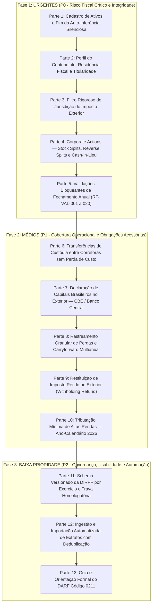

# Roadmap de Compliance Tributário — FiscoAtlas

**Sistema:** FiscoAtlas (Apuração de IRPF para Investimentos no Exterior — Lei nº 14.754/2023 e IN RFB nº 2.180/2024)  
**Documento Base:** [`requisitos_funcionais_compliance_investimentos_exterior_BR.md`](requisitos_funcionais_compliance_investimentos_exterior_BR.md) e [`resultado.md`](resultado.md)  
**Metodologia de Desenvolvimento:** *Test-Driven Development* (TDD) via Claude Code com fluxo de branches (`CLAUDE.md`).

---

## 1. Visão Geral da Estrutura do Roadmap

O saneamento das lacunas identificadas na auditoria está organizado em **3 Níveis de Prioridade** e **13 Partes modulares independentes**, concebidas para permitir o fluxo contínuo de *vibecoding* com TDD estruturado:



---

## 2. Divisão das Lacunas por Nível de Prioridade

| Prioridade | Definição de Risco | Partes | Requisitos Cobertos | Impacto se não Sanado |
| :--- | :--- | :---: | :--- | :--- |
| **URGENTES (P0)** | Violação direta da Lei 14.754/2023, risco de cálculo materialmente incorreto, perda de histórico fiscal ou apuração indevida. | **Partes 1 a 5** | RF-AST-003, 006, 007, 009; RF-PER-001 a 005; RF-FTC-004; RF-CA-001 a 008; RF-VAL-001 a 020 | Malha fina, tributação de não residentes, classificação errônea de ETFs/REITs como ações ordinárias, falhas críticas ao desdobrar ações (Splits). |
| **MÉDIOS (P1)** | Rastreabilidade tributária, integridade na migração de ativos entre contas e conformidade com obrigações acessórias (CBE e Altas Rendas). | **Partes 6 a 10** | RF-IMP-008; RF-CST-003, 004; RF-CBE-001 a 007; RF-LOS-006, 007; RF-FTC-009; RF-HI-001 a 004 | Risco de multas graves perante o Banco Central (CBE), descontinuidade de custo médio em transferências de corretora e passivo em reembolsos de imposto. |
| **BAIXA PRIORIDADE (P2)** | Governança de schemas futuros, automação operacional de ingestão e facilitação na emissão de guias DAA. | **Partes 11 a 13** | RF-ARQ-002, 003; RF-DIR-005, 013; RF-IMP-001 a 004; RF-DARF-001, 005 | Dependência de digitação manual de notas de corretagem e risco de desatualização de códigos procedimentais de exercícios futuros da DIRPF. |

---

## 3. Diretrizes de Execução com Claude Code (TDD & Branches)

Para cada parte abaixo, o Claude Code deverá seguir o fluxo estabelecido no `CLAUDE.md`:
1. **Branch**: Criar uma branch específica `fix/<nome>` ou `feat/<nome>` a partir de `main`.
2. **Ciclo TDD**:
   - **RED**: Escrever os testes em `tests/` cobrindo rigorosamente as asserções legais. Executar e confirmar falha.
   - **GREEN**: Implementar a alteração mínima necessária no código de produção até que todos os testes passem.
   - **REFACTOR**: Limpar o código preservando a tipagem, docstrings e convenções do projeto.
3. **Merge**: Fazer merge em `main` após 100% dos testes da suíte passarem.

---

# 4. Prompts Prontos para Execução (Parte a Parte)

---

## FASE 1: URGENTES (P0)

### PARTE 1 — Cadastro Explícito de Ativos e Fim da Auto-inferência Silenciosa
- **Requisitos:** RF-AST-003, RF-AST-006, RF-AST-007, RF-AST-009, RF-ARQ-006, RF-VAL-002
- **Branch:** `fix/explicit-asset-types`

#### Prompt para Claude Code:
```markdown
Atue como desenvolvedor sênior Python/Django especialista em compliance tributário.
Nosso objetivo é sanar as violações de RF-AST-003, RF-AST-006, RF-AST-007, RF-AST-009 e RF-ARQ-006 no FiscoAtlas, implementando TDD rigoroso.

CONTEXTO DO PROBLEMA:
Em `ledger/forms.py` (L90-93), o método `clean_asset_ticker` executa `Asset.objects.get_or_create(...)` definindo silenciosamente `asset_type="STOCK"`, `country_code="US"` e `description=ticker`. Isso viola a proibição de regras silenciosas, pois ETFs (ex: VOO), REITs (ex: O) e Treasuries (ex: TLT) são cadastrados como ações ordinárias por omissão. Além disso, `Asset.asset_type` não possui a taxonomia legal da Lei 14.754/2023 nem detecção de entidades controladas (offshores) e trusts.

TAREFA (SEGUIR TDD):
1. Crie a branch `fix/explicit-asset-types`.
2. FASE VERMELHA (Testes):
   - Crie `tests/ledger/test_asset_compliance.py`.
   - Teste 1: `EventForm` deve rejeitar com `ValidationError` se o `asset_ticker` informado não estiver previamente cadastrado em `Asset`. Proibir auto-criação implícita.
   - Teste 2: O modelo `Asset` deve suportar os tipos: `FOREIGN_EQUITY`, `FOREIGN_ETF`, `REIT`, `US_TREASURY`, `FOREIGN_BOND`, `FOREIGN_FUND`, `CONTROLLED_ENTITY`, `TRUST`, `UNKNOWN`.
   - Teste 3: `Asset` deve possuir campos `is_controlled_entity` (BooleanField) e `ownership_share_pct` (DecimalField, default 0).
   - Teste 4: Em `fiscal/engine.py`, se um evento referenciar ativo com `legal_asset_type in ("CONTROLLED_ENTITY", "TRUST", "UNKNOWN")` ou `is_controlled_entity=True`, `TaxEngine.compute()` deve lançar `ValidationError` com bloqueio explicativo (regime não coberto por aplicação financeira direta).
3. FASE VERDE (Implementação):
   - Atualize `Asset` em `ledger/models.py`. Gere e aplique a migration.
   - Modifique `clean_asset_ticker` em `ledger/forms.py` para consultar apenas ativos existentes com `active=True`.
   - Crie `AssetForm` e views/templates para cadastro explícito do ativo com descrição, natureza jurídica e confirmação de não-controle.
   - Adicione a checagem bloqueante no `TaxEngine` (`fiscal/engine.py`).
4. Execute `pytest tests/ledger/test_asset_compliance.py` e garanta que todos os testes passem. Faça commit e merge na `main`.
```

---

### PARTE 2 — Perfil Fiscal do Contribuinte, Residência Fiscal e Titularidade
- **Requisitos:** RF-PER-001, RF-PER-002, RF-PER-003, RF-PER-004, RF-PER-005, RF-VAL-001
- **Branch:** `fix/tax-residency-profile`

#### Prompt para Claude Code:
```markdown
Atue como engenheiro de software Django e especialista em compliance tributário brasileiro.
Implemente o controle obrigatório de residência fiscal e titularidade no FiscoAtlas seguindo TDD (RF-PER-001 a RF-PER-005 e RF-VAL-001).

CONTEXTO DO PROBLEMA:
O modelo `Profile` (`fiscal/models.py:L5-L16`) só tem `name` e `cpf`. Não armazena a condição de residência fiscal brasileira (`tax_residency_status`), nem datas de mudança de residência (DSDP). Se o usuário for não residente, o sistema calcula imposto indevidamente sob a Lei 14.754/2023. Além disso, `BrokerAccount` não registra conta conjunta nem a fatia percentual do contribuinte.

TAREFA (SEGUIR TDD):
1. Crie a branch `fix/tax-residency-profile`.
2. FASE VERMELHA (Testes):
   - Crie `tests/fiscal/test_tax_residency.py`.
   - Teste 1: `Profile` deve aceitar `tax_residency_status` com opções: `BRAZIL_RESIDENT`, `NON_RESIDENT`, `PART_YEAR_RESIDENT`, `UNKNOWN`.
   - Teste 2: Se `tax_residency_status != "BRAZIL_RESIDENT"` (ou se `Profile` não estiver configurado), `TaxEngine.compute()` deve levantar `ValidationError("Contribuinte não qualificado como residente fiscal pleno no Brasil.")`.
   - Teste 3: `BrokerAccount` deve ter `ownership_type` (`INDIVIDUAL`, `JOINT`, `THIRD_PARTY`) e `ownership_share` (percentual de 0.01 a 100.00).
   - Teste 4: Em conta conjunta com 50% de titularidade (`ownership_share=50.00`), o relatório (`ReportService`) deve demonstrar os saldos e rendimentos proporcionalmente atribuíveis ao contribuinte.
3. FASE VERDE (Implementação):
   - Atualize `Profile` em `fiscal/models.py` com `tax_residency_status`, `residency_start_date`, `residency_end_date` e `has_dsdp`.
   - Atualize `BrokerAccount` em `ledger/models.py`. Crie as migrations.
   - Ajuste `fiscal/profile_views.py` e formulários para permitir preencher esses campos.
   - Insira a trava bloqueante em `TaxEngine.compute()`.
4. Execute `pytest tests/fiscal/test_tax_residency.py` e garanta que todos os testes passem. Faça commit e merge na `main`.
```

---

### PARTE 3 — Filtro Rigoroso de Jurisdição do Crédito de Imposto Exterior
- **Requisitos:** RF-FTC-002, RF-FTC-003, RF-FTC-004, RF-VAL-009
- **Branch:** `fix/foreign-tax-federal-filter`

#### Prompt para Claude Code:
```markdown
Atue como especialista em compliance tributário e implemente a restrição jurídica de aproveitamento de crédito de imposto pago no exterior via TDD (RF-FTC-004 e RF-FTC-002).

CONTEXTO DO PROBLEMA:
No Brasil, a compensação de imposto pago nos EUA (Lei 14.754/2023, art. 4º) decorre do reconhecimento de reciprocidade de tratamento para tributos FEDERAIS sobre a renda (Internal Revenue Code). Tributos estaduais ou municipais (State/Local Income Tax) não são compensáveis. Atualmente, `fiscal/engine.py` (L110-113) aproveita qualquer `ForeignTaxPayment` sem validar `jurisdiction_level == "FEDERAL"`, o que pode gerar compensação indevida de State Tax.

TAREFA (SEGUIR TDD):
1. Crie a branch `fix/foreign-tax-federal-filter`.
2. FASE VERMELHA (Testes):
   - Crie `tests/fiscal/test_foreign_tax_eligibility.py`.
   - Teste 1: Um dividendo de US$ 100 com `tax_usd=30`, onde o `ForeignTaxPayment` possui `jurisdiction_level="FEDERAL"` e `country_code="US"`, deve gerar crédito aproveitável de R$ 15% do bruto (conforme regra atual).
   - Teste 2: Um dividendo com `ForeignTaxPayment` que possua `jurisdiction_level="STATE"` ou `LOCAL` deve gerar `credit_used = 0` no `TaxEngine` e ser discriminado em `fiscal/report.py` como imposto não elegível por falta de previsão legal de reciprocidade.
   - Teste 3: Imposto pago em país sem reciprocidade ou tratado deve ser rejeitado para crédito fiscal.
3. FASE VERDE (Implementação):
   - Atualize `TaxEngine.compute()` em `fiscal/engine.py` para filtrar rigorosamente a elegibilidade do crédito fiscal: exigir `pagamento.jurisdiction_level == "FEDERAL"` e reciprocidade confirmada.
   - Em `fiscal/report.py`, segregue `ineligible_foreign_tax_brl` para demonstrar ao usuário o imposto estadual pago que não pôde ser aproveitado.
4. Execute `pytest tests/fiscal/test_foreign_tax_eligibility.py`. Faça commit e merge na `main`.
```

---

### PARTE 4 — Corporate Actions (Stock Splits, Reverse Splits e Cash-in-Lieu)
- **Requisitos:** RF-CA-001, RF-CA-002, RF-CA-003, RF-EVT, CT-016, CT-017
- **Branch:** `feat/corporate-actions-split`

#### Prompt para Claude Code:
```markdown
Atue como engenheiro financeiro e contábil em Python.
Implemente suporte completo a desdobramento (Stock Split), grupamento (Reverse Split) e frações em dinheiro (Cash-in-lieu) seguindo TDD (RF-CA-001 a RF-CA-003).

CONTEXTO DO PROBLEMA:
Atualmente, o FiscoAtlas suporta apenas BUY, SELL, DIVIDEND, JUROS, APORTE e WITHDRAWAL. Se uma empresa desdobra ações (ex.: Nvidia 10:1, Apple 4:1), o investidor tem mais ações na corretora sem gastar nada. Como o sistema exige `price_usd > 0` e não possui evento de Split, o usuário não consegue registrar o aumento de quantidade, causando erro de posição insuficiente na venda subsequente (`ledger/service.py:L63`).
Regra Legal: O Split altera a quantidade e reduz o custo unitário médio, mas o CUSTO TOTAL HISTÓRICO EM BRL PERMANECE INALTERADO.

TAREFA (SEGUIR TDD):
1. Crie a branch `feat/corporate-actions-split`.
2. FASE VERMELHA (Testes):
   - Crie `tests/ledger/test_corporate_actions.py`.
   - Teste 1 (CT-016): Posição inicial de 10 ações a US$ 100 (PTAX 5,00 = Custo R$ 5.000,00). Ocorre um Stock Split de 2:1. A posição final deve ser 20 ações, custo fiscal em BRL deve continuar R$ 5.000,00 e o custo médio por ação deve cair de R$ 500,00 para R$ 250,00.
   - Teste 2: Venda posterior de 15 ações desdobradas deve ter custo baixado de 15 × R$ 250,00 = R$ 3.750,00, calculando ganho/perda de capital perfeitamente.
   - Teste 3 (CT-017): Reverse split 1:10 com fração liquidada (*cash-in-lieu* de 0.5 ação paga em dinheiro). A fração deve gerar baixa de custo e apuração de alienação proporcional.
3. FASE VERDE (Implementação):
   - Adicione `STOCK_SPLIT`, `REVERSE_SPLIT` e `CASH_IN_LIEU` a `EVENT_TYPES` em `ledger/models.py`.
   - Adicione campos `split_ratio_from` e `split_ratio_to` (ex: 1 para 2) em `FinancialEvent`.
   - Atualize `PositionService.position()` e `PositionService.realized()` em `ledger/position.py` para processar splits.
   - Atualize `EventService.record()` e `EventForm` para aceitar splits sem exigir `price_usd`.
4. Execute `pytest tests/ledger/test_corporate_actions.py`. Faça commit e merge na `main`.
```

---

### PARTE 5 — Validações Bloqueantes de Fechamento Anual
- **Requisitos:** RF-VAL-001 a RF-VAL-020
- **Branch:** `feat/annual-closing-validations`

#### Prompt para Claude Code:
```markdown
Atue como auditor técnico de software tributário.
Implemente o validador bloqueante do fechamento da apuração anual (`AnnualAssessment.confirmed = True`) cobrindo as 20 condições de RF-VAL-001 a RF-VAL-020 via TDD.

CONTEXTO DO PROBLEMA:
Atualmente, a view de confirmação do ano fecha o `AnnualAssessment` sem auditar precondições fiscais. O sistema permite confirmar o ano mesmo se houver: residência desconhecida (RF-VAL-001), ativo UNKNOWN (RF-VAL-002), venda a descoberto sem short sale homologado (RF-VAL-006), crédito de imposto exterior sem documento ou acima do limite (RF-VAL-008/009), e contas com divergência de caixa ou custódia.

TAREFA (SEGUIR TDD):
1. Crie a branch `feat/annual-closing-validations`.
2. FASE VERMELHA (Testes):
   - Crie `tests/fiscal/test_closing_validator.py`.
   - Crie testes unitários para a classe `AnnualClosingValidator`:
     * Bloquear se `Profile` não tiver residência confirmada como `BRAZIL_RESIDENT`.
     * Bloquear se houver qualquer `Asset` com `asset_type == "UNKNOWN"`.
     * Bloquear se qualquer evento ativo tiver `amount_brl is None` ou `fx_rate is None`.
     * Bloquear se houver venda com quantidade superior ao saldo em custódia na data da operação.
     * Bloquear se `ForeignTaxPayment` exceder 15% do rendimento bruto individual.
     * Bloquear se houver carryforward de imposto retido no exterior.
3. FASE VERDE (Implementação):
   - Crie `fiscal/validator.py` contendo a classe `AnnualClosingValidator` com método `validate_or_raise(year: int)`.
   - Em `fiscal/views.py` (ou onde o botão "Confirmar Fechamento" é acionado), invoque `AnnualClosingValidator.validate_or_raise(year)` dentro de uma transação.
   - Exiba mensagens claras e explicativas na interface para cada violação encontrada.
4. Execute `pytest tests/fiscal/test_closing_validator.py`. Faça commit e merge na `main`.
```

---

## FASE 2: MÉDIOS (P1)

### PARTE 6 — Transferências de Custódia entre Corretoras sem Perda de Custo
- **Requisitos:** RF-IMP-008, RF-CST-003, RF-CST-004, CT-014, CT-015
- **Branch:** `feat/broker-transfers`

#### Prompt para Claude Code:
```markdown
Atue como engenheiro de software e implemente transferências de custódia e caixa entre corretoras do mesmo titular via TDD (RF-IMP-008, RF-CST-003 e RF-CST-004).

CONTEXTO DO PROBLEMA:
Se um investidor transfere 10 ações da Apple da corretora Avenue para a Charles Schwab, hoje ele precisa lançar saídas e entradas avulsas, o que corrompe o custo médio em BRL ou é tratado erroneamente como venda tributável. A transferência entre contas do mesmo titular NÃO é venda e deve transportar a quantidade e o custo acumulado em BRL integralmente.

TAREFA (SEGUIR TDD):
1. Crie a branch `feat/broker-transfers`.
2. FASE VERMELHA (Testes):
   - Crie `tests/ledger/test_broker_transfers.py`.
   - Teste 1 (CT-014): Criar Conta A (Schwab) e Conta B (IBKR) do mesmo titular. Comprar 100 ações de AAPL na Conta A a US$ 150 (PTAX 5,00 = Custo R$ 75.000). Transferir 40 ações da Conta A para a Conta B.
   - Assert: A Conta A deve restar com 60 ações (Custo R$ 45.000). A Conta B deve ficar com 40 ações (Custo R$ 30.000).
   - Assert: Nenhum evento de ganho de capital ou alienação tributável pode ser gerado no `TaxEngine` ou `PositionService.realized()`.
   - Teste 2: Transferências sem ponta pareada (`transfer_pair_id`) devem gerar alerta de inconsistência.
3. FASE VERDE (Implementação):
   - Adicione `BROKER_TRANSFER_IN` e `BROKER_TRANSFER_OUT` em `EVENT_TYPES`.
   - Adicione campo `transfer_pair_id = models.UUIDField(null=True, blank=True)` em `FinancialEvent`.
   - Crie `BrokerTransferService` que registra o par de eventos atomicamente.
   - Atualize `PositionService` para transferir custo histórico sem apurar ganho/perda.
4. Execute `pytest tests/ledger/test_broker_transfers.py`. Faça commit e merge na `main`.
```

---

### PARTE 7 — Declaração de Capitais Brasileiros no Exterior (CBE / BACEN)
- **Requisitos:** RF-CBE-001 a RF-CBE-007, CT-019, CT-020, CT-021
- **Branch:** `feat/cbe-compliance`

#### Prompt para Claude Code:
```markdown
Atue como especialista em regulação cambial e tributária brasileira.
Implemente o módulo de conformidade com a Declaração de Capitais Brasileiros no Exterior (CBE / Banco Central - Resolução BCB nº 279/2022) via TDD (RF-CBE-001 a RF-CBE-007).

CONTEXTO DO PROBLEMA:
O FiscoAtlas não possui nenhuma menção ou cálculo da CBE. Todo residente fiscal brasileiro com ativos no exterior que somem US$ 1.000.000,00 ou mais na data-base de 31 de dezembro é obrigado a entregar a CBE Anual ao Banco Central, sob pena de multas de até R$ 250.000,00. Quando o valor for inferior, o sistema deve registrar `CBE_UNDETERMINED` a menos que o usuário declare formalmente a completude patrimonial.

TAREFA (SEGUIR TDD):
1. Crie a branch `feat/cbe-compliance`.
2. FASE VERMELHA (Testes):
   - Crie `tests/fiscal/test_cbe.py`.
   - Teste 1 (CT-019): Patrimônio em 31/12 totalizando US$ 999.999,00 sem confirmação de completude de outros bens fora da plataforma. Status retornado: `CBE_UNDETERMINED`.
   - Teste 2: Patrimônio de US$ 999.999,00 com flag `external_assets_declared_complete=True` no Profile. Status retornado: `CBE_NOT_REQUIRED`.
   - Teste 3 (CT-020): Patrimônio em 31/12 totalizando US$ 1.000.000,00. Status retornado: `CBE_REQUIRED` (alerta de obrigatoriedade anual).
   - Teste 4: Patrimônio >= US$ 100.000.000,00 deve emitir alerta de obrigação trimestral.
3. FASE VERDE (Implementação):
   - Crie o serviço `fiscal/cbe.py` (`CbeService`).
   - Avalie o saldo de todas as contas ativas (caixa + valor patrimonial) em 31/12.
   - Integre o relatório da CBE em `ReportService.build()` e na tela de encerramento.
4. Execute `pytest tests/fiscal/test_cbe.py`. Faça commit e merge na `main`.
```

---

### PARTE 8 — Rastreamento Granular de Perdas e Carryforward Multianual
- **Requisitos:** RF-LOS-006, RF-LOS-007, CT-004, CT-005
- **Branch:** `feat/loss-ledger-carryforward`

#### Prompt para Claude Code:
```markdown
Atue como engenheiro de sistemas tributários.
Implemente um Ledger dedicado de perdas compensáveis com histórico e rastreabilidade multianual (*Loss Ledger*) via TDD (RF-LOS-006 e RF-LOS-007).

CONTEXTO DO PROBLEMA:
Atualmente, o `TaxEngine` herda apenas o valor total escalar `prev.loss_carryforward_brl` do ano anterior. Não há memória auditável de qual ano ou evento de alienação gerou cada prejuízo, quanto foi compensado em cada ano posterior e quanto ainda resta a compensar.

TAREFA (SEGUIR TDD):
1. Crie a branch `feat/loss-ledger-carryforward`.
2. FASE VERMELHA (Testes):
   - Crie `tests/fiscal/test_loss_ledger.py`.
   - Teste 1 (CT-004 e CT-005):
     * Ano 2024: Venda gera perda de R$ 20.000. Rendimentos do ano: R$ 5.000. Perda compensada: R$ 5.000. Saldo transportado para 2025: R$ 15.000.
     * Ano 2025: Rendimentos: R$ 10.000. Perda de 2024 compensada: R$ 10.000. Saldo transportado para 2026: R$ 5.000.
   - Teste 2: O relatório anual deve discriminar a perda herdada detalhando o ano de origem (ex: "R$ 5.000 originados em 2024").
3. FASE VERDE (Implementação):
   - Crie o modelo `LossRecord` em `fiscal/models.py`.
   - Conecte a criação do `LossRecord` às alienações com resultado negativo em `TaxEngine`.
   - Na compensação anual, utilize a regra FIFO de prejuízos acumulados e atualize os saldos remanescentes de forma auditável.
4. Execute `pytest tests/fiscal/test_loss_ledger.py`. Faça commit e merge na `main`.
```

---

### PARTE 9 — Restituição de Imposto Retido no Exterior (Withholding Refund)
- **Requisitos:** RF-FTC-009, RF-EVT, CT-008
- **Branch:** `feat/withholding-refund`

#### Prompt para Claude Code:
```markdown
Atue como desenvolvedor Python e implemente suporte a restituição de imposto retido a maior no exterior (*Withholding Refund*) via TDD (RF-FTC-009 e CT-008).

CONTEXTO DO PROBLEMA:
Investidores frequentemente recebem estornos de imposto retido nos EUA (ex: reclassificação de proventos de REITs no formulário 1042-S pela corretora). O FiscoAtlas não suporta esse evento. Quando ocorre, o crédito tributário aproveitado anteriormente precisa ser recalculado e estornado.

TAREFA (SEGUIR TDD):
1. Crie a branch `feat/withholding-refund`.
2. FASE VERMELHA (Testes):
   - Crie `tests/fiscal/test_withholding_refund.py`.
   - Teste 1: Um evento `WITHHOLDING_REFUND` de US$ 10 referente a um dividendo do mesmo ano-calendário deve estornar a retenção original e recalcular a base de imposto retido e crédito aproveitável.
   - Teste 2: Se o refund ocorrer em ano subsequente ao fechamento do exercício, o sistema deve emitir alerta bloqueante indicando necessidade de retificação da DAA do ano anterior.
3. FASE VERDE (Implementação):
   - Adicione `WITHHOLDING_REFUND` a `EVENT_TYPES` em `ledger/models.py`.
   - Trate o evento no `TaxEngine` e em `fiscal/report.py`.
4. Execute `pytest tests/fiscal/test_withholding_refund.py`. Faça commit e merge na `main`.
```

---

### PARTE 10 — Tributação Mínima de Altas Rendas (Ano-Calendário 2026)
- **Requisitos:** RF-HI-001 a RF-HI-004, CT-024, CT-025
- **Branch:** `feat/high-income-tax-2026`

#### Prompt para Claude Code:
```markdown
Atue como especialista tributário e implemente a verificação da tributação mínima de altas rendas (Lei nº 15.270/2025) para o ano-calendário 2026 via TDD (RF-HI-001 a RF-HI-004).

CONTEXTO DO PROBLEMA:
A partir de 2026, contribuintes com renda global anual superior a R$ 600.000,00 ficam sujeitos a regras de tributação mínima progressiva (até 10%). Como o FiscoAtlas apura rendimentos no exterior, deve alertar o contribuinte sobre a incidência desse gatilho.

TAREFA (SEGUIR TDD):
1. Crie a branch `feat/high-income-tax-2026`.
2. FASE VERMELHA (Testes):
   - Crie `tests/fiscal/test_high_income.py`.
   - Teste 1: Para `tax_year < 2026`, o módulo não deve ser acionado.
   - Teste 2 (CT-024): Para `tax_year == 2026` com rendimentos no exterior de R$ 100.000, status deve ser `HIGH_INCOME_TEST_UNDETERMINED` com mensagem instrutiva.
   - Teste 3 (CT-025): Para `tax_year == 2026` com rendimentos no exterior superiores a R$ 600.000, status deve ser `HIGH_INCOME_THRESHOLD_EXCEEDED` com alerta destacado na DAA.
3. FASE VERDE (Implementação):
   - Crie `HighIncomeService` em `fiscal/high_income.py`.
   - Exponha o resultado no relatório de `fiscal/report.py`.
4. Execute `pytest tests/fiscal/test_high_income.py`. Faça commit e merge na `main`.
```

---

## FASE 3: BAIXA PRIORIDADE (P2)

### PARTE 11 — Schema Versionado da DIRPF por Exercício
- **Requisitos:** RF-ARQ-002, RF-ARQ-003, RF-DIR-005, RF-DIR-013
- **Branch:** `feat/versioned-dirpf-schema`

#### Prompt para Claude Code:
```markdown
Atue como arquiteto de software Django.
Mova as tabelas estáticas de códigos da DIRPF (`GRUPO_CODIGO` e `COUNTRY_RFB`) para schemas versionados por exercício fiscal com trava de homologação via TDD (RF-ARQ-002 e RF-ARQ-003).

CONTEXTO DO PROBLEMA:
Em `fiscal/report.py:L14-16`, os códigos de bens e direitos da DIRPF são constantes estáticas. Não há garantia de que o exercício seguinte usará a mesma estrutura, nem há mecanismo para travar anos sem IN publicada pela Receita Federal.

TAREFA (SEGUIR TDD):
1. Crie a branch `feat/versioned-dirpf-schema`.
2. FASE VERMELHA (Testes):
   - Crie `tests/fiscal/test_dirpf_schema.py`.
   - Teste 1: Sistema deve permitir cadastrar schemas da DIRPF para exercícios específicos (`filing_year`).
   - Teste 2: Se um relatório for solicitado para exercício cujo schema tem `is_homologated=False`, o relatório deve conter flag `status: "PRELIMINAR"`.
3. FASE VERDE (Implementação):
   - Crie o modelo `DirpfSchema` em `fiscal/models.py`.
   - Atualize `ReportService` para buscar códigos a partir do `DirpfSchema`.
4. Execute `pytest tests/fiscal/test_dirpf_schema.py`. Faça commit e merge na `main`.
```

---

### PARTE 12 — Ingestão Automatizada de Extratos com Deduplicação
- **Requisitos:** RF-IMP-001 a RF-IMP-004, CT-030
- **Branch:** `feat/csv-importer`

#### Prompt para Claude Code:
```markdown
Atue como engenheiro de software e desenvolva o pipeline de importação de arquivos CSV de corretoras com garantia de idempotência e deduplicação via TDD (RF-IMP-001 a RF-IMP-004, CT-030).

CONTEXTO DO PROBLEMA:
Atualmente não há importador automático; todos os lançamentos são manuais. Precisamos suportar importação de extratos CSV de corretoras (ex: Charles Schwab / Avenue), garantindo que reimportar o mesmo arquivo não duplique transações.

TAREFA (SEGUIR TDD):
1. Crie a branch `feat/csv-importer`.
2. FASE VERMELHA (Testes):
   - Crie `tests/ledger/test_statement_importer.py`.
   - Teste 1: Importar um CSV de exemplo da Schwab com 1 compra e 1 dividendo. Validar criação correta dos eventos.
   - Teste 2 (CT-030): Reimportar exatamente o mesmo arquivo CSV. O sistema deve detectar duplicidade pelo hash do arquivo e identificadores das operações, sem criar nenhum novo evento.
3. FASE VERDE (Implementação):
   - Crie `ledger/importers/base.py` e `ledger/importers/schwab.py`.
   - Crie modelo `ImportBatch` com `file_hash`, data e contagem de eventos importados.
   - Adicione view e interface para upload do CSV com tela de pré-visualização.
4. Execute `pytest tests/ledger/test_statement_importer.py`. Faça commit e merge na `main`.
```

---

### PARTE 13 — Guia e Orientação Formal do DARF Código 0211
- **Requisitos:** RF-DARF-001, RF-DARF-005, CT-029
- **Branch:** `feat/darf-0211-guide`

#### Prompt para Claude Code:
```markdown
Atue como especialista em interface tributária e desenvolva a visualização formal de orientação do DARF código 0211 na apuração anual via TDD (RF-DARF-001 e CT-029).

CONTEXTO DO PROBLEMA:
O FiscoAtlas apura o saldo do imposto devido, mas não fornece a ficha/guia orientativa com o código de receita correto (0211 - IRPF Ajuste Anual) e as orientações de pagamento (cota única com vencimento no último dia útil de abril ou parcelamento em até 8 quotas com juros Selic).

TAREFA (SEGUIR TDD):
1. Crie a branch `feat/darf-0211-guide`.
2. FASE VERMELHA (Testes):
   - Crie `tests/fiscal/test_darf_guide.py`.
   - Teste 1: Apuração com saldo devedor de R$ 1.500,00 deve gerar objeto `darf_info` com código de receita `"0211"`, descrição `"IRPF — Declaração de Ajuste Anual"`, valor da cota única e simulação de parcelamento.
   - Teste 2: Se imposto devido < R$ 10,00, informar dispensa legal de emissão de DARF.
3. FASE VERDE (Implementação):
   - Crie o gerador `fiscal/darf.py`.
   - Adicione a seção no template e no PDF do relatório anual.
4. Execute `pytest tests/fiscal/test_darf_guide.py`. Faça commit e merge na `main`.
```

---

## 5. Checklist de Conclusão do Roadmap

- [ ] **Parte 1:** Cadastro explícito de ativos e fim da inferência silenciosa
- [ ] **Parte 2:** Residência fiscal e titularidade de contas
- [ ] **Parte 3:** Filtro estrito de jurisdição federal no crédito de imposto
- [ ] **Parte 4:** Corporate actions (Stock Split, Reverse Split e Cash-in-Lieu)
- [ ] **Parte 5:** Validações bloqueantes no encerramento anual
- [ ] **Parte 6:** Transferências de custódia entre corretoras
- [ ] **Parte 7:** Módulo de conformidade com a CBE / Banco Central
- [ ] **Parte 8:** Ledger granular de perdas compensáveis multianual
- [ ] **Parte 9:** Restituição de imposto no exterior (Withholding Refund)
- [ ] **Parte 10:** Tributação mínima de altas rendas (Lei 15.270/2025 - ano 2026)
- [ ] **Parte 11:** Versionamento de schemas da DIRPF por exercício
- [ ] **Parte 12:** Importação automatizada de extratos CSV
- [ ] **Parte 13:** Painel de orientação do DARF código 0211
